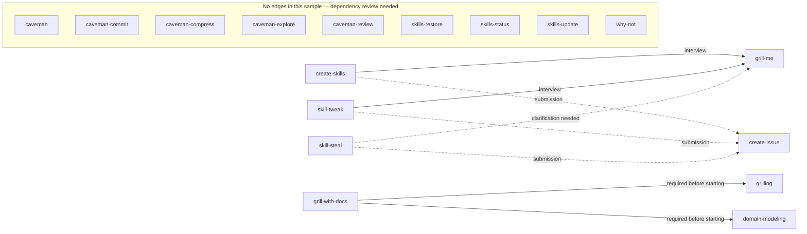
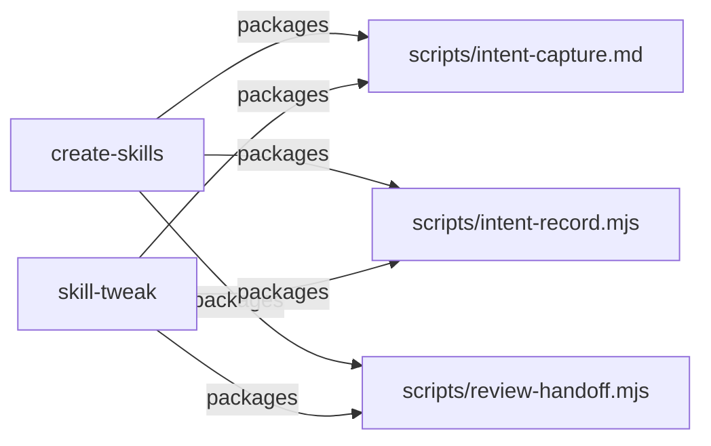

# Skill dependency map — prototype

**Accepted presentation prototype for [#53](https://github.com/AndrewGodlewsky/andrew-skills/issues/53).**
This is a throwaway presentation sample, not a maintained or complete map.
It asks: can a maintainer quickly see what to review before changing a skill?

For the combined graph-and-table prototype, run this from the repository root:

```sh
node docs/prototypes/skill-map/server.mjs
```

Open [the local prototype](http://127.0.0.1:43853/?variant=A). The **Overview
graph** is the main view. Choose **All skills** to scan the dependency table;
click a skill's row to return to the graph with that skill selected and its
connections highlighted. Both views retain the same selection and sample.
This read-only viewer demonstrates the owner's selected direction; production
delivery and maintenance are specified in the
[resolved implementation handoff](planning/skill-map-implementation-handoff.md)
and tracked by [#61](https://github.com/AndrewGodlewsky/andrew-skills/issues/61),
[#62](https://github.com/AndrewGodlewsky/andrew-skills/issues/62) and
[#63](https://github.com/AndrewGodlewsky/andrew-skills/issues/63).

## Source and coverage

- **Source:** working files inspected on 2026-09-22, based on commit
  `d53402ff3a58e2824686d502810caa6362dabc0f`. This Markdown sample is hand-authored.
- **Inventory:** all 17 current skill folders. The local viewer rereads the
  inventory and checks its selected evidence at page load; reload after changes.
- **Evidence:** eight actual skill dependencies sampled from four callers'
  `SKILL.md` files. Relevant bundled resources have not been fully audited.
- **Review status:** package-wide dependency review is needed for every skill.
  No recorded dependency does **not** establish that a skill has none.
- **Meaning:** A → B means A relies on B. Follow arrows backward from a changed
  skill to identify callers to review. Potential impact is not proven breakage.

## Overview graph

Every arrow below is an actual dependency in the inspected instructions.
Dashed arrows are conditional dependencies, never recommendations. Select a
skill in the local viewer to highlight its callers and see supporting quotes.



The following tables are the text alternative when Mermaid is unavailable.

## Example change: Grill Me

**Three direct callers, no indirect callers recorded in this sample.**
This is the sample's review scope, not a claim of a completed dependency audit.

| Caller to review | Path | When it relies on Grill Me | Source evidence |
| --- | --- | --- | --- |
| Create Skills | create-skills → grill-me | Interview | [Instructions](../skills/create-skills/SKILL.md): “Resolve and invoke the selected enabled **GT grill-me** skill for the interview” |
| Skill Tweak | skill-tweak → grill-me | Interview | [Instructions](../skills/skill-tweak/SKILL.md): “Resolve and invoke the selected enabled **GT grill-me** skill” |
| Skill Steal | skill-steal → grill-me | Intent is unclear or adaptation could change behavior | [Instructions](../skills/skill-steal/SKILL.md): “When intent is unclear or compatibility work could change behavior” followed by the instruction to invoke the selected GT Grill Me |

Grill Me has no outgoing dependencies recorded in this sample. Its package-wide
review is still pending. The viewer makes the same distinction for every skill.

## Full inventory and dependency table

All rows need package-wide dependency review. “None recorded” describes this
sample and must not be read as confirmed absence. Counts describe direct callers.

| Skill | Relies on in this sample | Direct callers |
| --- | --- | ---: |
| [caveman](../skills/caveman/SKILL.md) | None recorded | 0 |
| [caveman-commit](../skills/caveman-commit/SKILL.md) | None recorded | 0 |
| [caveman-compress](../skills/caveman-compress/SKILL.md) | None recorded | 0 |
| [caveman-explore](../skills/caveman-explore/SKILL.md) | None recorded | 0 |
| [caveman-review](../skills/caveman-review/SKILL.md) | None recorded | 0 |
| [create-issue](../skills/create-issue/SKILL.md) | None recorded | 3 |
| [create-skills](../skills/create-skills/SKILL.md) | grill-me; create-issue for submission | 0 |
| [domain-modeling](../skills/domain-modeling/SKILL.md) | None recorded | 1 |
| [grill-me](../skills/grill-me/SKILL.md) | None recorded | 3 |
| [grill-with-docs](../skills/grill-with-docs/SKILL.md) | grilling; domain-modeling, both before starting | 0 |
| [grilling](../skills/grilling/SKILL.md) | None recorded | 1 |
| [skill-steal](../skills/skill-steal/SKILL.md) | grill-me for clarification; create-issue for submission | 0 |
| [skill-tweak](../skills/skill-tweak/SKILL.md) | grill-me; create-issue for submission | 0 |
| [skills-restore](../skills/skills-restore/SKILL.md) | None recorded | 0 |
| [skills-status](../skills/skills-status/SKILL.md) | None recorded | 0 |
| [skills-update](../skills/skills-update/SKILL.md) | None recorded | 0 |
| [why-not](../skills/why-not/SKILL.md) | None recorded | 0 |

### Other sampled evidence

| Relationship | Condition and supporting instructions |
| --- | --- |
| Create Skills → Create Issue | [Submission](../skills/create-skills/SKILL.md): “Resolve the intended enabled GT **create-issue** model-invocable dependency” |
| Skill Tweak → Create Issue | [Submission](../skills/skill-tweak/SKILL.md): “If publication is intended, resolve the enabled GT create-issue dependency”. Draft-only work explicitly does not require resolving it. |
| Skill Steal → Create Issue | [Submission](../skills/skill-steal/SKILL.md): “deliver one handoff through the selected enabled GT **create-issue**” |
| Grill with Docs → Grilling and Domain Modeling | [Composition](../skills/grill-with-docs/SKILL.md): “Before starting, resolve and invoke both enabled dependencies” and “Both must be loaded before interviewing or writing documents” |

### Reviewed exclusion

[Skills Update](../skills/skills-update/SKILL.md) mentions Skills Restore as an
optional, separately requested route and says: “Do not invoke restore, export or
inspect personal copies automatically.” **No dependency arrow is shown.**
This classifies that reference only; it does not complete the package review.

## Optional expanded view — shared-source sample

These relationships mean **packages this shared source**, not invokes another
skill. Both the [creator builder](../scripts/build-create-skills.mjs) and
[tweak builder](../scripts/build-skill-tweak.mjs) establish the following inputs.
Generated copies are not separate authored sources. This is a bounded example,
not an exhaustive inventory of either builder's inputs or all consumers.



| Maintained source | Sampled consuming packages |
| --- | --- |
| [intent-capture.md](../scripts/intent-capture.md) | create-skills; skill-tweak |
| [intent-record.mjs](../scripts/intent-record.mjs) | create-skills; skill-tweak |
| [review-handoff.mjs](../scripts/review-handoff.mjs) | create-skills; skill-tweak |

## Hypothetical display checks — not GT relationships

Use the local viewer's **Source / example** selector to inspect these fixtures.
They are never mixed into the real repository sample.

| Example | What the presentation must communicate |
| --- | --- |
| A → B → C, with isolated D; change C | B is direct; A is indirect through B. Keep the branch condition and isolated D visible. |
| A → B → A, with C → A; change A | Show the cycle. List B and C once each; do not count the changed skill as its own caller. |
| Caller → old-skill-name, with a new unreviewed skill | Show the missing target without guessing a rename. Keep the new skill visible without asserting it has no dependencies. |

## Accepted presentation — overview graph plus dependency table

Andrew preferred option A because the overview graph is more visual and easier
to follow quickly. He requested option C's dependency table as a way to scan all
skills, then click a skill to open it in option A's graph.

The revised prototype combines these into two linked views. A table-row click
opens the overview, selects the skill, highlights its connections and updates
the impact/evidence panel. Returning to the table preserves the selected row.
Skills with no sample edges still open in the overview with a clear selection
and review-needed message. The separate change-first variant and experimental
layout switcher have been removed.

Andrew reviewed the combined interaction and accepted it: “Okay, I think this
looks great. Let's continue.” The diagram and tables above remain the
text/Markdown fallback. Freshness, authoring workflow and implementation
handoff are tracked in [#54](https://github.com/AndrewGodlewsky/andrew-skills/issues/54).
Rewrite the accepted design during implementation and remove the throwaway
prototype; do not ship it as-is.
