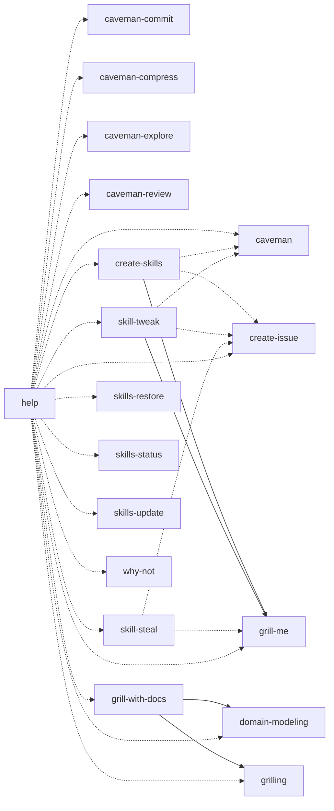

# GT skill dependency map

Snapshot: `553354fe38cd4e838ba776a2596cb2b5afbd2472f99c29fe63f54585876c38ea`. Source: current working files when generated.
Saved output cannot detect later edits. Recorded review is current for this snapshot.

A → B means A relies on B; dashed arrows are conditional. Potential impact means review scope, not proven breakage.

```mermaid
flowchart LR
  n0["caveman"]
  n1["caveman-commit"]
  n2["caveman-compress"]
  n3["caveman-explore"]
  n4["caveman-review"]
  n5["create-issue"]
  n6["create-skills"]
  n7["domain-modeling"]
  n8["grill-me"]
  n9["grill-with-docs"]
  n10["grilling"]
  n11["help"]
  n12["skill-steal"]
  n13["skill-tweak"]
  n14["skills-restore"]
  n15["skills-status"]
  n16["skills-update"]
  n17["why-not"]
  n6 --> n8
  n6 -.-> n5
  n13 --> n8
  n13 -.-> n5
  n12 -.-> n8
  n12 -.-> n5
  n9 --> n10
  n9 --> n7
  n11 -.-> n0
  n11 -.-> n1
  n11 -.-> n2
  n11 -.-> n3
  n11 -.-> n4
  n11 -.-> n5
  n11 -.-> n6
  n11 -.-> n7
  n11 -.-> n8
  n11 -.-> n9
  n11 -.-> n10
  n11 -.-> n12
  n11 -.-> n13
  n11 -.-> n14
  n11 -.-> n15
  n11 -.-> n16
  n11 -.-> n17
  n6 -.-> n0
  n13 -.-> n0
```

## All skills

| Skill | Relies on | Callers to review | Review |
| --- | --- | --- | --- |
| caveman | None recorded | create-skills, help, skill-tweak | Reviewed |
| caveman-commit | None recorded | help | Reviewed |
| caveman-compress | None recorded | help | Reviewed |
| caveman-explore | None recorded | help | Reviewed |
| caveman-review | None recorded | help | Reviewed |
| create-issue | None recorded | create-skills, help, skill-steal, skill-tweak | Reviewed |
| create-skills | grill-me, create-issue, caveman | help | Reviewed |
| domain-modeling | None recorded | grill-with-docs, help | Reviewed |
| grill-me | None recorded | create-skills, help, skill-steal, skill-tweak | Reviewed |
| grill-with-docs | grilling, domain-modeling | help | Reviewed |
| grilling | None recorded | grill-with-docs, help | Reviewed |
| help | caveman, caveman-commit, caveman-compress, caveman-explore, caveman-review, create-issue, create-skills, domain-modeling, grill-me, grill-with-docs, grilling, skill-steal, skill-tweak, skills-restore, skills-status, skills-update, why-not | None recorded | Reviewed |
| skill-steal | grill-me, create-issue | help | Reviewed |
| skill-tweak | grill-me, create-issue, caveman | help | Reviewed |
| skills-restore | None recorded | help | Reviewed |
| skills-status | None recorded | help | Reviewed |
| skills-update | None recorded | help | Reviewed |
| why-not | None recorded | help | Reviewed |

## All shared and bundled resources

| Resource | Present | Skills to review |
| --- | --- | --- |
| CONTRIBUTING.md | Yes | create-skills, help, skill-steal |
| exporter/bundle.json | Yes | None recorded |
| exporter/export-cli.mjs | Yes | None recorded |
| exporter/export-filesystem.mjs | Yes | None recorded |
| exporter/export-protocol.mjs | Yes | None recorded |
| exporter/export-source.mjs | Yes | None recorded |
| exporter/plugin-layout.mjs | Yes | None recorded |
| exporter/README.md | Yes | help, skills-restore |
| exporter/release-catalog-reader.mjs | Yes | None recorded |
| exporter/release-catalog.mjs | Yes | None recorded |
| exporter/release-snapshots.mjs | Yes | None recorded |
| exporter/release-validation.mjs | Yes | None recorded |
| exporter/run.mjs | Yes | None recorded |
| plugins/gt/skills/caveman-commit/LICENSE | Yes | None recorded |
| plugins/gt/skills/caveman-commit/README.md | Yes | None recorded |
| plugins/gt/skills/caveman-commit/SKILL.md | Yes | caveman-commit, help |
| plugins/gt/skills/caveman-compress/LICENSE | Yes | caveman-compress, help |
| plugins/gt/skills/caveman-compress/README.md | Yes | caveman-compress, help |
| plugins/gt/skills/caveman-compress/scripts/&#95;&#95;init&#95;&#95;.py | Yes | caveman-compress, help |
| plugins/gt/skills/caveman-compress/scripts/&#95;&#95;main&#95;&#95;.py | Yes | caveman-compress, help |
| plugins/gt/skills/caveman-compress/scripts/benchmark.py | Yes | caveman-compress, help |
| plugins/gt/skills/caveman-compress/scripts/cli.py | Yes | caveman-compress, help |
| plugins/gt/skills/caveman-compress/scripts/compress.py | Yes | caveman-compress, help |
| plugins/gt/skills/caveman-compress/scripts/detect.py | Yes | caveman-compress, help |
| plugins/gt/skills/caveman-compress/scripts/validate.py | Yes | caveman-compress, help |
| plugins/gt/skills/caveman-compress/SECURITY.md | Yes | caveman-compress, help |
| plugins/gt/skills/caveman-compress/SKILL.md | Yes | caveman-compress, help |
| plugins/gt/skills/caveman-explore/LICENSE | Yes | None recorded |
| plugins/gt/skills/caveman-explore/README.md | Yes | None recorded |
| plugins/gt/skills/caveman-explore/SKILL.md | Yes | caveman-explore, help |
| plugins/gt/skills/caveman-review/LICENSE | Yes | None recorded |
| plugins/gt/skills/caveman-review/README.md | Yes | None recorded |
| plugins/gt/skills/caveman-review/SKILL.md | Yes | caveman-review, help |
| plugins/gt/skills/caveman/LICENSE | Yes | caveman, create-skills, help, skill-tweak |
| plugins/gt/skills/caveman/README.md | Yes | caveman, create-skills, help, skill-tweak |
| plugins/gt/skills/caveman/SKILL.md | Yes | caveman, create-skills, help, skill-tweak |
| plugins/gt/skills/create-issue/references/helper.md | Yes | create-issue, create-skills, help, skill-steal, skill-tweak |
| plugins/gt/skills/create-issue/references/labels.md | Yes | create-issue, create-skills, help, skill-steal, skill-tweak |
| plugins/gt/skills/create-issue/scripts/api.mjs | Yes | create-issue, create-skills, help, skill-steal, skill-tweak |
| plugins/gt/skills/create-issue/scripts/contract.mjs | Yes | create-issue, create-skills, help, skill-steal, skill-tweak |
| plugins/gt/skills/create-issue/scripts/run.mjs | Yes | create-issue, create-skills, help, skill-steal, skill-tweak |
| plugins/gt/skills/create-issue/scripts/runtime.mjs | Yes | create-issue, create-skills, help, skill-steal, skill-tweak |
| plugins/gt/skills/create-issue/scripts/service.mjs | Yes | create-issue, create-skills, help, skill-steal, skill-tweak |
| plugins/gt/skills/create-issue/SKILL.md | Yes | create-issue, create-skills, help, skill-steal, skill-tweak |
| plugins/gt/skills/create-skills/assets/matt-pocock-license.txt | Yes | create-skills, help |
| plugins/gt/skills/create-skills/references/intent-capture.md | Yes | create-skills, help |
| plugins/gt/skills/create-skills/references/issue-prose.md | Yes | create-skills, help |
| plugins/gt/skills/create-skills/references/package-rules.md | Yes | create-skills, help |
| plugins/gt/skills/create-skills/references/personal-installation.md | Yes | create-skills, help |
| plugins/gt/skills/create-skills/references/specification.md | Yes | create-skills, help |
| plugins/gt/skills/create-skills/references/submission.md | Yes | create-skills, help, skill-steal |
| plugins/gt/skills/create-skills/references/tools.md | Yes | create-skills, help, skill-steal |
| plugins/gt/skills/create-skills/references/writing.md | Yes | create-skills, help |
| plugins/gt/skills/create-skills/scripts/install.mjs | Yes | create-skills, help |
| plugins/gt/skills/create-skills/scripts/intent-record.mjs | Yes | create-skills, help |
| plugins/gt/skills/create-skills/scripts/package.mjs | Yes | create-skills, help |
| plugins/gt/skills/create-skills/scripts/plugin-layout.mjs | Yes | create-skills, help |
| plugins/gt/skills/create-skills/scripts/release-validation.mjs | Yes | create-skills, help |
| plugins/gt/skills/create-skills/scripts/review-handoff.mjs | Yes | create-skills, help |
| plugins/gt/skills/create-skills/scripts/run.mjs | Yes | create-skills, help |
| plugins/gt/skills/create-skills/scripts/skill-package-validation.mjs | Yes | create-skills, help |
| plugins/gt/skills/create-skills/scripts/submission.mjs | Yes | create-skills, help |
| plugins/gt/skills/create-skills/SKILL.md | Yes | create-skills, help |
| plugins/gt/skills/domain-modeling/ADR-FORMAT.md | Yes | domain-modeling, grill-with-docs, help |
| plugins/gt/skills/domain-modeling/assets/matt-pocock-license.txt | Yes | domain-modeling, grill-with-docs, help |
| plugins/gt/skills/domain-modeling/CONTEXT-FORMAT.md | Yes | domain-modeling, grill-with-docs, help |
| plugins/gt/skills/domain-modeling/SKILL.md | Yes | domain-modeling, grill-with-docs, help |
| plugins/gt/skills/grill-me/SKILL.md | Yes | create-skills, grill-me, help, skill-steal, skill-tweak |
| plugins/gt/skills/grill-with-docs/assets/matt-pocock-license.txt | Yes | grill-with-docs, help |
| plugins/gt/skills/grill-with-docs/SKILL.md | Yes | grill-with-docs, help |
| plugins/gt/skills/grilling/assets/matt-pocock-license.txt | Yes | grill-with-docs, grilling, help |
| plugins/gt/skills/grilling/SKILL.md | Yes | grill-with-docs, grilling, help |
| plugins/gt/skills/help/assets/matt-pocock-license.txt | Yes | help |
| plugins/gt/skills/help/SKILL.md | Yes | help |
| plugins/gt/skills/skill-steal/references/clarification.md | Yes | help, skill-steal |
| plugins/gt/skills/skill-steal/references/package-rules.md | Yes | help, skill-steal |
| plugins/gt/skills/skill-steal/references/source.md | Yes | help, skill-steal |
| plugins/gt/skills/skill-steal/references/submission.md | Yes | help, skill-steal |
| plugins/gt/skills/skill-steal/references/tools.md | Yes | help, skill-steal |
| plugins/gt/skills/skill-steal/scripts/intent-record.mjs | Yes | help, skill-steal |
| plugins/gt/skills/skill-steal/scripts/package.mjs | Yes | help, skill-steal |
| plugins/gt/skills/skill-steal/scripts/plugin-layout.mjs | Yes | help, skill-steal |
| plugins/gt/skills/skill-steal/scripts/release-validation.mjs | Yes | help, skill-steal |
| plugins/gt/skills/skill-steal/scripts/review-handoff.mjs | Yes | help, skill-steal |
| plugins/gt/skills/skill-steal/scripts/run.mjs | Yes | help, skill-steal |
| plugins/gt/skills/skill-steal/scripts/skill-package-validation.mjs | Yes | help, skill-steal |
| plugins/gt/skills/skill-steal/scripts/submission.mjs | Yes | help, skill-steal |
| plugins/gt/skills/skill-steal/SKILL.md | Yes | help, skill-steal |
| plugins/gt/skills/skill-tweak/references/evidence.md | Yes | help, skill-tweak |
| plugins/gt/skills/skill-tweak/references/intent-capture.md | Yes | help, skill-tweak |
| plugins/gt/skills/skill-tweak/references/issue-prose.md | Yes | help, skill-tweak |
| plugins/gt/skills/skill-tweak/references/submission.md | Yes | help, skill-tweak |
| plugins/gt/skills/skill-tweak/scripts/intent-record.mjs | Yes | help, skill-tweak |
| plugins/gt/skills/skill-tweak/scripts/review-handoff.mjs | Yes | help, skill-tweak |
| plugins/gt/skills/skill-tweak/scripts/run.mjs | Yes | help, skill-tweak |
| plugins/gt/skills/skill-tweak/scripts/submission.mjs | Yes | help, skill-tweak |
| plugins/gt/skills/skill-tweak/SKILL.md | Yes | help, skill-tweak |
| plugins/gt/skills/skill-tweak/templates/issue.md | Yes | help, skill-tweak |
| plugins/gt/skills/skills-restore/references/operations.md | Yes | help, skills-restore |
| plugins/gt/skills/skills-restore/scripts/exporter/bundle.json | Yes | help, skills-restore |
| plugins/gt/skills/skills-restore/scripts/exporter/export-cli.mjs | Yes | help, skills-restore |
| plugins/gt/skills/skills-restore/scripts/exporter/export-filesystem.mjs | Yes | help, skills-restore |
| plugins/gt/skills/skills-restore/scripts/exporter/export-protocol.mjs | Yes | help, skills-restore |
| plugins/gt/skills/skills-restore/scripts/exporter/export-source.mjs | Yes | help, skills-restore |
| plugins/gt/skills/skills-restore/scripts/exporter/plugin-layout.mjs | Yes | help, skills-restore |
| plugins/gt/skills/skills-restore/scripts/exporter/README.md | Yes | help, skills-restore |
| plugins/gt/skills/skills-restore/scripts/exporter/release-catalog-reader.mjs | Yes | help, skills-restore |
| plugins/gt/skills/skills-restore/scripts/exporter/release-catalog.mjs | Yes | help, skills-restore |
| plugins/gt/skills/skills-restore/scripts/exporter/release-snapshots.mjs | Yes | help, skills-restore |
| plugins/gt/skills/skills-restore/scripts/exporter/release-validation.mjs | Yes | help, skills-restore |
| plugins/gt/skills/skills-restore/scripts/exporter/run.mjs | Yes | help, skills-restore |
| plugins/gt/skills/skills-restore/SKILL.md | Yes | help, skills-restore |
| plugins/gt/skills/skills-status/references/installation-target.md | Yes | help, skills-status |
| plugins/gt/skills/skills-status/SKILL.md | Yes | help, skills-status |
| plugins/gt/skills/skills-update/references/installation-target.md | Yes | help, skills-update |
| plugins/gt/skills/skills-update/references/update-report.md | Yes | help, skills-update |
| plugins/gt/skills/skills-update/SKILL.md | Yes | help, skills-update |
| plugins/gt/skills/why-not/SKILL.md | Yes | help, why-not |
| scripts/build-create-skills.mjs | Yes | create-skills, help, skill-steal |
| scripts/build-exporter.mjs | Yes | help, skills-restore |
| scripts/build-issue-submission.mjs | Yes | create-issue, create-skills, help, skill-steal, skill-tweak |
| scripts/build-skill-steal.mjs | Yes | help, skill-steal |
| scripts/build-skill-tweak.mjs | Yes | help, skill-tweak |
| scripts/create-skills/install.mjs | Yes | create-skills, help |
| scripts/create-skills/package.mjs | Yes | create-skills, help, skill-steal |
| scripts/create-skills/run.mjs | Yes | create-skills, help |
| scripts/create-skills/submission.mjs | Yes | create-skills, help, skill-steal |
| scripts/export-cli.mjs | Yes | help, skills-restore |
| scripts/export-filesystem.mjs | Yes | help, skills-restore |
| scripts/export-launcher.mjs | Yes | help, skills-restore |
| scripts/export-protocol.mjs | Yes | help, skills-restore |
| scripts/export-source.mjs | Yes | help, skills-restore |
| scripts/intent-capture.md | Yes | create-skills, help, skill-tweak |
| scripts/intent-record.mjs | Yes | create-skills, help, skill-steal, skill-tweak |
| scripts/issue-prose.md | Yes | create-skills, help, skill-tweak |
| scripts/issue-submission/api.mjs | Yes | create-issue, create-skills, help, skill-steal, skill-tweak |
| scripts/issue-submission/contract.mjs | Yes | create-issue, create-skills, help, skill-steal, skill-tweak |
| scripts/issue-submission/run.mjs | Yes | create-issue, create-skills, help, skill-steal, skill-tweak |
| scripts/issue-submission/runtime.mjs | Yes | create-issue, create-skills, help, skill-steal, skill-tweak |
| scripts/issue-submission/service.mjs | Yes | create-issue, create-skills, help, skill-steal, skill-tweak |
| scripts/plugin-layout.mjs | Yes | create-skills, help, skill-steal, skills-restore |
| scripts/release-catalog-reader.mjs | Yes | help, skills-restore |
| scripts/release-catalog.mjs | Yes | help, skills-restore |
| scripts/release-snapshots.mjs | Yes | help, skills-restore |
| scripts/release-validation.mjs | Yes | create-skills, help, skill-steal, skills-restore |
| scripts/review-handoff.mjs | Yes | create-skills, help, skill-steal, skill-tweak |
| scripts/skill-package-validation.mjs | Yes | create-skills, help, skill-steal |
| scripts/skill-steal/run.mjs | Yes | help, skill-steal |
| scripts/skill-tweak/run.mjs | Yes | help, skill-tweak |
| scripts/skill-tweak/submission.mjs | Yes | help, skill-tweak |

## All declared dependencies and source provenance

### caveman → plugins/gt/skills/caveman/SKILL.md

entry; current. Skill entry instructions

Discovered skill entry instructions.

### caveman-commit → plugins/gt/skills/caveman-commit/SKILL.md

entry; current. Skill entry instructions

Discovered skill entry instructions.

### caveman-compress → plugins/gt/skills/caveman-compress/SKILL.md

entry; current. Skill entry instructions

Discovered skill entry instructions.

### caveman-explore → plugins/gt/skills/caveman-explore/SKILL.md

entry; current. Skill entry instructions

Discovered skill entry instructions.

### caveman-review → plugins/gt/skills/caveman-review/SKILL.md

entry; current. Skill entry instructions

Discovered skill entry instructions.

### create-issue → plugins/gt/skills/create-issue/SKILL.md

entry; current. Skill entry instructions

Discovered skill entry instructions.

### create-skills → plugins/gt/skills/create-skills/SKILL.md

entry; current. Skill entry instructions

Discovered skill entry instructions.

### domain-modeling → plugins/gt/skills/domain-modeling/SKILL.md

entry; current. Skill entry instructions

Discovered skill entry instructions.

### grill-me → plugins/gt/skills/grill-me/SKILL.md

entry; current. Skill entry instructions

Discovered skill entry instructions.

### grill-with-docs → plugins/gt/skills/grill-with-docs/SKILL.md

entry; current. Skill entry instructions

Discovered skill entry instructions.

### grilling → plugins/gt/skills/grilling/SKILL.md

entry; current. Skill entry instructions

Discovered skill entry instructions.

### help → plugins/gt/skills/help/SKILL.md

entry; current. Skill entry instructions

Discovered skill entry instructions.

### skill-steal → plugins/gt/skills/skill-steal/SKILL.md

entry; current. Skill entry instructions

Discovered skill entry instructions.

### skill-tweak → plugins/gt/skills/skill-tweak/SKILL.md

entry; current. Skill entry instructions

Discovered skill entry instructions.

### skills-restore → plugins/gt/skills/skills-restore/SKILL.md

entry; current. Skill entry instructions

Discovered skill entry instructions.

### skills-status → plugins/gt/skills/skills-status/SKILL.md

entry; current. Skill entry instructions

Discovered skill entry instructions.

### skills-update → plugins/gt/skills/skills-update/SKILL.md

entry; current. Skill entry instructions

Discovered skill entry instructions.

### why-not → plugins/gt/skills/why-not/SKILL.md

entry; current. Skill entry instructions

Discovered skill entry instructions.

### create-skills → grill-me

skill; current. During required intake: select the enabled GT Grill Me from the intended installation, load and follow its instructions, and record the interview and user confirmation; use a separate invocation operation only when the host requires it.

- [plugins/gt/skills/create-skills/SKILL.md:16](../../plugins/gt/skills/create-skills/SKILL.md#L16) (current): Select the enabled &#42;&#42;GT grill-me&#42;&#42; skill, load its instructions and follow them
- [scripts/intent-capture.md:5](../../scripts/intent-capture.md#L5) (current): Create Skills and Skill Tweak must select the exposed, enabled &#42;&#42;GT grill-me&#42;&#42;
- [plugins/gt/skills/create-skills/references/intent-capture.md:5](../../plugins/gt/skills/create-skills/references/intent-capture.md#L5) (current): Create Skills and Skill Tweak must select the exposed, enabled &#42;&#42;GT grill-me&#42;&#42;
- [plugins/gt/skills/create-skills/references/specification.md:5](../../plugins/gt/skills/create-skills/references/specification.md#L5) (current): selected GT grill-me dependency using the &#91;intent guide&#93;(intent-capture.md).

### create-skills → create-issue

skill; current. When submitting the handoff (conditional)

- [plugins/gt/skills/create-skills/SKILL.md:45](../../plugins/gt/skills/create-skills/SKILL.md#L45) (current):    enabled GT &#42;&#42;create-issue&#42;&#42; model-invocable dependency using the client-supplied
- [scripts/review-handoff.mjs:69](../../scripts/review-handoff.mjs#L69) (current): // Stateless next-action calculation. Only the enabled create-issue skill executes
- [plugins/gt/skills/create-skills/references/personal-installation.md:33](../../plugins/gt/skills/create-skills/references/personal-installation.md#L33) (current): create-issue before copying, under actual authority. A later partial submission
- [plugins/gt/skills/create-skills/references/submission.md:3](../../plugins/gt/skills/create-skills/references/submission.md#L3) (current): Resolve and invoke the intended enabled GT create-issue dependency. It supplies
- [plugins/gt/skills/create-skills/scripts/review-handoff.mjs:69](../../plugins/gt/skills/create-skills/scripts/review-handoff.mjs#L69) (current): // Stateless next-action calculation. Only the enabled create-issue skill executes
- [plugins/gt/skills/create-skills/references/tools.md:7](../../plugins/gt/skills/create-skills/references/tools.md#L7) (current): submission still requires the create-issue dependency's own runtime prerequisites.

### skill-tweak → grill-me

skill; current. During required intake: select the enabled GT Grill Me from the intended installation, load and follow its instructions, and record the interview and user confirmation; use a separate invocation operation only when the host requires it.

- [plugins/gt/skills/skill-tweak/SKILL.md:28](../../plugins/gt/skills/skill-tweak/SKILL.md#L28) (current): 3. &#42;&#42;Interview through GT Grill Me.&#42;&#42; Select the enabled &#42;&#42;GT grill-me&#42;&#42; skill,
- [scripts/intent-capture.md:5](../../scripts/intent-capture.md#L5) (current): Create Skills and Skill Tweak must select the exposed, enabled &#42;&#42;GT grill-me&#42;&#42;
- [plugins/gt/skills/skill-tweak/references/intent-capture.md:5](../../plugins/gt/skills/skill-tweak/references/intent-capture.md#L5) (current): Create Skills and Skill Tweak must select the exposed, enabled &#42;&#42;GT grill-me&#42;&#42;

### skill-tweak → create-issue

skill; current. When publication is intended; draft-only work does not require it (conditional)

- [plugins/gt/skills/skill-tweak/SKILL.md:48](../../plugins/gt/skills/skill-tweak/SKILL.md#L48) (current):    resolve the enabled GT create-issue dependency before final preview from the client-supplied
- [scripts/review-handoff.mjs:69](../../scripts/review-handoff.mjs#L69) (current): // Stateless next-action calculation. Only the enabled create-issue skill executes
- [plugins/gt/skills/skill-tweak/references/submission.md:33](../../plugins/gt/skills/skill-tweak/references/submission.md#L33) (current): ## Delivery through create-issue
- [plugins/gt/skills/skill-tweak/scripts/review-handoff.mjs:69](../../plugins/gt/skills/skill-tweak/scripts/review-handoff.mjs#L69) (current): // Stateless next-action calculation. Only the enabled create-issue skill executes

### skill-steal → grill-me

skill; current. When intent is unclear or compatibility work could change behavior (conditional)

- [plugins/gt/skills/skill-steal/SKILL.md:26](../../plugins/gt/skills/skill-steal/SKILL.md#L26) (current):    selected enabled GT &#42;&#42;grill-me&#42;&#42;. Pass findings, conflicts, previous answers and
- [plugins/gt/skills/skill-steal/references/clarification.md:3](../../plugins/gt/skills/skill-steal/references/clarification.md#L3) (current): Use the client-supplied selected GT installation identity. Resolve &#42;&#42;grill-me&#42;&#42;
- [plugins/gt/skills/skill-steal/references/source.md:29](../../plugins/gt/skills/skill-steal/references/source.md#L29) (current): contract. Identify these effects, preserve supported semantics, and use Grill Me

### skill-steal → create-issue

skill; current. When submitting the review handoff (conditional)

- [plugins/gt/skills/skill-steal/SKILL.md:46](../../plugins/gt/skills/skill-steal/SKILL.md#L46) (current):    and deliver one handoff through the selected enabled GT &#42;&#42;create-issue&#42;&#42;.
- [scripts/review-handoff.mjs:69](../../scripts/review-handoff.mjs#L69) (current): // Stateless next-action calculation. Only the enabled create-issue skill executes
- [plugins/gt/skills/skill-steal/references/clarification.md:4](../../plugins/gt/skills/skill-steal/references/clarification.md#L4) (current): for necessary clarification and &#42;&#42;create-issue&#42;&#42; when submission is intended,
- [plugins/gt/skills/skill-steal/references/submission.md:5](../../plugins/gt/skills/skill-steal/references/submission.md#L5) (current): Resolve and invoke the intended enabled GT create-issue dependency. It supplies
- [plugins/gt/skills/skill-steal/scripts/review-handoff.mjs:69](../../plugins/gt/skills/skill-steal/scripts/review-handoff.mjs#L69) (current): // Stateless next-action calculation. Only the enabled create-issue skill executes
- [plugins/gt/skills/skill-steal/references/tools.md:9](../../plugins/gt/skills/skill-steal/references/tools.md#L9) (current): submission still requires the create-issue dependency's own runtime prerequisites.

### grill-with-docs → grilling

skill; current. Before starting the composed interview/document workflow

- [plugins/gt/skills/grill-with-docs/SKILL.md:13](../../plugins/gt/skills/grill-with-docs/SKILL.md#L13) (current): Before starting, resolve and invoke both enabled dependencies, &#96;grilling&#96; and &#96;domain-modeling&#96;, from the same selected GT installation using the client's

### grill-with-docs → domain-modeling

skill; current. Before starting the composed interview/document workflow

- [plugins/gt/skills/grill-with-docs/SKILL.md:13](../../plugins/gt/skills/grill-with-docs/SKILL.md#L13) (current): Before starting, resolve and invoke both enabled dependencies, &#96;grilling&#96; and &#96;domain-modeling&#96;, from the same selected GT installation using the client's

### exporter/export-cli.mjs → exporter/export-filesystem.mjs

resource; current. When loading this module

- [exporter/export-cli.mjs:4](../../exporter/export-cli.mjs#L4) (current): import { checkedPath, inspectCopy, targetPaths } from './export-filesystem.mjs';

### exporter/export-cli.mjs → exporter/export-protocol.mjs

resource; current. When loading this module

- [exporter/export-cli.mjs:3](../../exporter/export-cli.mjs#L3) (current): import { acquireCatalog, checkRuntime, executePlan, makePlan, reviewPlan } from './export-protocol.mjs';

### exporter/export-cli.mjs → exporter/export-source.mjs

resource; current. When loading this module

- [exporter/export-cli.mjs:5](../../exporter/export-cli.mjs#L5) (current): import { PROTOCOL&#95;VERSION, requireExport } from './export-source.mjs';

### exporter/export-filesystem.mjs → exporter/export-source.mjs

resource; current. When loading this module

- [exporter/export-filesystem.mjs:8](../../exporter/export-filesystem.mjs#L8) (current): import { EXPORTER&#95;VERSION, PROTOCOL&#95;VERSION, REPOSITORY, prepareSource, requireExport, sha256, validateSourcePath } from './export-source.mjs';

### exporter/export-protocol.mjs → exporter/export-filesystem.mjs

resource; current. When loading this module

- [exporter/export-protocol.mjs:7](../../exporter/export-protocol.mjs#L7) (current): import { checkedPath, createCopy, ensureDirectory, isSecurityError, targetPaths } from './export-filesystem.mjs';

### exporter/export-protocol.mjs → exporter/export-source.mjs

resource; current. When loading this module

- [exporter/export-protocol.mjs:8](../../exporter/export-protocol.mjs#L8) (current): import { EXPORTER&#95;VERSION, PROTOCOL&#95;VERSION, REPOSITORY, fileManifest, prepareSource, requireExport, sha256 } from './export-source.mjs';

### exporter/export-protocol.mjs → exporter/release-catalog-reader.mjs

resource; current. When loading this module

- [exporter/export-protocol.mjs:5](../../exporter/export-protocol.mjs#L5) (current): import { readReleaseCatalog, repositoryIdentity } from './release-catalog-reader.mjs';

### exporter/export-protocol.mjs → exporter/release-snapshots.mjs

resource; current. When loading this module

- [exporter/export-protocol.mjs:6](../../exporter/export-protocol.mjs#L6) (current): import { readFirstParentCommits, readGitFiles, readGitSkillTrees, readRepositoryOrigin, resolveCommit } from './release-snapshots.mjs';

### exporter/export-source.mjs → exporter/release-catalog.mjs

resource; current. When loading this module

- [exporter/export-source.mjs:6](../../exporter/export-source.mjs#L6) (current): import { skillContentIdentity } from './release-catalog.mjs';

### exporter/export-source.mjs → exporter/release-validation.mjs

resource; current. When loading this module

- [exporter/export-source.mjs:5](../../exporter/export-source.mjs#L5) (current): import { parseRelease } from './release-validation.mjs';

### exporter/release-catalog-reader.mjs → exporter/release-catalog.mjs

resource; current. When loading this module

- [exporter/release-catalog-reader.mjs:5](../../exporter/release-catalog-reader.mjs#L5) (current): import { buildReleaseCatalog } from './release-catalog.mjs';

### exporter/release-catalog-reader.mjs → exporter/release-snapshots.mjs

resource; current. When loading this module

- [exporter/release-catalog-reader.mjs:6](../../exporter/release-catalog-reader.mjs#L6) (current): import { readFirstParentCommits, readGitFiles, readGitSkillTrees, readRepositoryOrigin, resolveCommit } from './release-snapshots.mjs';

### exporter/release-catalog.mjs → exporter/release-validation.mjs

resource; current. When loading this module

- [exporter/release-catalog.mjs:4](../../exporter/release-catalog.mjs#L4) (current): import { parseRelease, readBaseline, releaseEntry, validateReleaseChange } from './release-validation.mjs';

### scripts/create-skills/install.mjs → scripts/create-skills/package.mjs

resource; current. When loading this module

- [scripts/create-skills/install.mjs:5](../../scripts/create-skills/install.mjs#L5) (current): import { checkPackage, readPackage, regularDirectory } from './package.mjs';

### scripts/create-skills/package.mjs → scripts/skill-package-validation.mjs

resource; current. When loading this module

- [scripts/create-skills/package.mjs:4](../../scripts/create-skills/package.mjs#L4) (current): import { validateSkill } from '../skill-package-validation.mjs';

### scripts/create-skills/run.mjs → scripts/create-skills/install.mjs

resource; current. When loading this module

- [scripts/create-skills/run.mjs:6](../../scripts/create-skills/run.mjs#L6) (current): import { installPackage } from './install.mjs';

### scripts/create-skills/run.mjs → scripts/create-skills/package.mjs

resource; current. When loading this module

- [scripts/create-skills/run.mjs:3](../../scripts/create-skills/run.mjs#L3) (current): import { checkDirectory } from './package.mjs';

### scripts/create-skills/run.mjs → scripts/create-skills/submission.mjs

resource; current. When loading this module

- [scripts/create-skills/run.mjs:4](../../scripts/create-skills/run.mjs#L4) (current): import { prepareSubmission, nextSubmission, submissionLimits } from './submission.mjs';

### scripts/create-skills/submission.mjs → scripts/create-skills/package.mjs

resource; current. When loading this module

- [scripts/create-skills/submission.mjs:1](../../scripts/create-skills/submission.mjs#L1) (current): import { sha256, readPackage } from './package.mjs';

### scripts/create-skills/submission.mjs → scripts/intent-record.mjs

resource; current. When loading this module

- [scripts/create-skills/submission.mjs:3](../../scripts/create-skills/submission.mjs#L3) (current): import { intentSections } from '../intent-record.mjs';

### scripts/create-skills/submission.mjs → scripts/review-handoff.mjs

resource; current. When loading this module

- [scripts/create-skills/submission.mjs:2](../../scripts/create-skills/submission.mjs#L2) (current): import { requireText, bytes, lf, split, fenced, prepareHandoff } from '../review-handoff.mjs';

### scripts/export-cli.mjs → scripts/export-filesystem.mjs

resource; current. When loading this module

- [scripts/export-cli.mjs:4](../../scripts/export-cli.mjs#L4) (current): import { checkedPath, inspectCopy, targetPaths } from './export-filesystem.mjs';

### scripts/export-cli.mjs → scripts/export-protocol.mjs

resource; current. When loading this module

- [scripts/export-cli.mjs:3](../../scripts/export-cli.mjs#L3) (current): import { acquireCatalog, checkRuntime, executePlan, makePlan, reviewPlan } from './export-protocol.mjs';

### scripts/export-cli.mjs → scripts/export-source.mjs

resource; current. When loading this module

- [scripts/export-cli.mjs:5](../../scripts/export-cli.mjs#L5) (current): import { PROTOCOL&#95;VERSION, requireExport } from './export-source.mjs';

### scripts/export-filesystem.mjs → scripts/export-source.mjs

resource; current. When loading this module

- [scripts/export-filesystem.mjs:8](../../scripts/export-filesystem.mjs#L8) (current): import { EXPORTER&#95;VERSION, PROTOCOL&#95;VERSION, REPOSITORY, prepareSource, requireExport, sha256, validateSourcePath } from './export-source.mjs';

### scripts/export-protocol.mjs → scripts/export-filesystem.mjs

resource; current. When loading this module

- [scripts/export-protocol.mjs:7](../../scripts/export-protocol.mjs#L7) (current): import { checkedPath, createCopy, ensureDirectory, isSecurityError, targetPaths } from './export-filesystem.mjs';

### scripts/export-protocol.mjs → scripts/export-source.mjs

resource; current. When loading this module

- [scripts/export-protocol.mjs:8](../../scripts/export-protocol.mjs#L8) (current): import { EXPORTER&#95;VERSION, PROTOCOL&#95;VERSION, REPOSITORY, fileManifest, prepareSource, requireExport, sha256 } from './export-source.mjs';

### scripts/export-protocol.mjs → scripts/release-catalog-reader.mjs

resource; current. When loading this module

- [scripts/export-protocol.mjs:5](../../scripts/export-protocol.mjs#L5) (current): import { readReleaseCatalog, repositoryIdentity } from './release-catalog-reader.mjs';

### scripts/export-protocol.mjs → scripts/release-snapshots.mjs

resource; current. When loading this module

- [scripts/export-protocol.mjs:6](../../scripts/export-protocol.mjs#L6) (current): import { readFirstParentCommits, readGitFiles, readGitSkillTrees, readRepositoryOrigin, resolveCommit } from './release-snapshots.mjs';

### scripts/export-source.mjs → scripts/release-catalog.mjs

resource; current. When loading this module

- [scripts/export-source.mjs:6](../../scripts/export-source.mjs#L6) (current): import { skillContentIdentity } from './release-catalog.mjs';

### scripts/export-source.mjs → scripts/release-validation.mjs

resource; current. When loading this module

- [scripts/export-source.mjs:5](../../scripts/export-source.mjs#L5) (current): import { parseRelease } from './release-validation.mjs';

### scripts/intent-record.mjs → scripts/review-handoff.mjs

resource; current. When loading this module

- [scripts/intent-record.mjs:1](../../scripts/intent-record.mjs#L1) (current): import { requireText } from './review-handoff.mjs';

### scripts/issue-submission/api.mjs → scripts/issue-submission/contract.mjs

resource; current. When loading this module

- [scripts/issue-submission/api.mjs:2](../../scripts/issue-submission/api.mjs#L2) (current): import { API, LIMITS, REPOSITORY, REPOSITORY&#95;ID, WEBSITE, SubmissionError, positiveId } from './contract.mjs';

### scripts/issue-submission/run.mjs → scripts/issue-submission/contract.mjs

resource; current. When loading this module

- [scripts/issue-submission/run.mjs:2](../../scripts/issue-submission/run.mjs#L2) (current): import { LIMITS, REPOSITORY, SubmissionError, decodeInput } from './contract.mjs';

### scripts/issue-submission/run.mjs → scripts/issue-submission/runtime.mjs

resource; current. When loading this module

- [scripts/issue-submission/run.mjs:3](../../scripts/issue-submission/run.mjs#L3) (current): import { createRuntime } from './runtime.mjs';

### scripts/issue-submission/run.mjs → scripts/issue-submission/service.mjs

resource; current. When loading this module

- [scripts/issue-submission/run.mjs:4](../../scripts/issue-submission/run.mjs#L4) (current): import { submit } from './service.mjs';

### scripts/issue-submission/runtime.mjs → scripts/issue-submission/contract.mjs

resource; current. When loading this module

- [scripts/issue-submission/runtime.mjs:4](../../scripts/issue-submission/runtime.mjs#L4) (current): import { API, LIMITS, SubmissionError } from './contract.mjs';

### scripts/issue-submission/service.mjs → scripts/issue-submission/api.mjs

resource; current. When loading this module

- [scripts/issue-submission/service.mjs:2](../../scripts/issue-submission/service.mjs#L2) (current): import { Session, issueRecord, commentRecord, sameText } from './api.mjs';

### scripts/issue-submission/service.mjs → scripts/issue-submission/contract.mjs

resource; current. When loading this module

- [scripts/issue-submission/service.mjs:1](../../scripts/issue-submission/service.mjs#L1) (current): import { API, LIMITS, REPOSITORY, WEBSITE, validateRequest, SubmissionError } from './contract.mjs';

### scripts/release-catalog-reader.mjs → scripts/release-catalog.mjs

resource; current. When loading this module

- [scripts/release-catalog-reader.mjs:5](../../scripts/release-catalog-reader.mjs#L5) (current): import { buildReleaseCatalog } from './release-catalog.mjs';

### scripts/release-catalog-reader.mjs → scripts/release-snapshots.mjs

resource; current. When loading this module

- [scripts/release-catalog-reader.mjs:6](../../scripts/release-catalog-reader.mjs#L6) (current): import { readFirstParentCommits, readGitFiles, readGitSkillTrees, readRepositoryOrigin, resolveCommit } from './release-snapshots.mjs';

### scripts/release-catalog.mjs → scripts/release-validation.mjs

resource; current. When loading this module

- [scripts/release-catalog.mjs:4](../../scripts/release-catalog.mjs#L4) (current): import { parseRelease, readBaseline, releaseEntry, validateReleaseChange } from './release-validation.mjs';

### scripts/skill-package-validation.mjs → scripts/release-validation.mjs

resource; current. When loading this module

- [scripts/skill-package-validation.mjs:2](../../scripts/skill-package-validation.mjs#L2) (current): import { parseRelease } from './release-validation.mjs';

### scripts/skill-steal/run.mjs → scripts/create-skills/package.mjs

resource; current. When loading this module

- [scripts/skill-steal/run.mjs:4](../../scripts/skill-steal/run.mjs#L4) (current): import { checkDirectory } from '../create-skills/package.mjs';

### scripts/skill-steal/run.mjs → scripts/create-skills/submission.mjs

resource; current. When loading this module

- [scripts/skill-steal/run.mjs:5](../../scripts/skill-steal/run.mjs#L5) (current): import { prepareSubmission, nextSubmission, submissionLimits } from '../create-skills/submission.mjs';

### scripts/skill-tweak/run.mjs → scripts/skill-tweak/submission.mjs

resource; current. When loading this module

- [scripts/skill-tweak/run.mjs:2](../../scripts/skill-tweak/run.mjs#L2) (current): import { prepareSubmission, nextSubmission, submissionLimits } from './submission.mjs';

### scripts/skill-tweak/submission.mjs → scripts/intent-record.mjs

resource; current. When loading this module

- [scripts/skill-tweak/submission.mjs:2](../../scripts/skill-tweak/submission.mjs#L2) (current): import { intentSections } from '../intent-record.mjs';

### scripts/skill-tweak/submission.mjs → scripts/review-handoff.mjs

resource; current. When loading this module

- [scripts/skill-tweak/submission.mjs:1](../../scripts/skill-tweak/submission.mjs#L1) (current): import { requireText, prepareHandoff } from '../review-handoff.mjs';

### plugins/gt/skills/caveman-commit/README.md → plugins/gt/skills/caveman-commit/LICENSE

resource; current. When copying or redistributing this package/guidance; preserve the notice (conditional)

- [plugins/gt/skills/caveman-commit/README.md:58](../../plugins/gt/skills/caveman-commit/README.md#L58) (current): The skill is covered by the &#91;MIT license&#93;(LICENSE); upstream &#91;licensing scope&#93;(https://github.com/JuliusBrussee/caveman/blob/2fd153c67988e980fb0b2455c90832159a6a5a25/LICENSING.md) classifies skills/ as MIT. This independent GT adaptation does not imply upstream sponsorship.

### plugins/gt/skills/caveman-commit/README.md → plugins/gt/skills/caveman-commit/SKILL.md

resource; current. When following the source guidance or its documented branch (conditional)

- [plugins/gt/skills/caveman-commit/README.md:51](../../plugins/gt/skills/caveman-commit/README.md#L51) (current): - &#91;&#96;SKILL.md&#96;&#93;(./SKILL.md) — full LLM-facing instructions

### plugins/gt/skills/caveman-compress/README.md → plugins/gt/skills/caveman-compress/LICENSE

resource; current. When copying or redistributing this package/guidance; preserve the notice (conditional)

- [plugins/gt/skills/caveman-compress/README.md:85](../../plugins/gt/skills/caveman-compress/README.md#L85) (current): copyright (c) 2026 Julius Brussee, under the exact bundled &#91;MIT license&#93;(LICENSE).

### plugins/gt/skills/caveman-compress/README.md → plugins/gt/skills/caveman-compress/scripts/&#95;&#95;main&#95;&#95;.py

resource; current. When following the source guidance or its documented branch (conditional)

- [plugins/gt/skills/caveman-compress/README.md:18](../../plugins/gt/skills/caveman-compress/README.md#L18) (current): &#91;entry point&#93;(scripts/&#95;&#95;main&#95;&#95;.py) invokes the &#91;CLI&#93;(scripts/cli.py). A missing

### plugins/gt/skills/caveman-compress/README.md → plugins/gt/skills/caveman-compress/scripts/benchmark.py

resource; current. When optionally measuring two files with the benchmark helper (conditional)

- [plugins/gt/skills/caveman-compress/README.md:71](../../plugins/gt/skills/caveman-compress/README.md#L71) (current): The optional &#91;benchmark helper&#93;(scripts/benchmark.py) compares two explicit files:

### plugins/gt/skills/caveman-compress/README.md → plugins/gt/skills/caveman-compress/scripts/cli.py

resource; current. When following the source guidance or its documented branch (conditional)

- [plugins/gt/skills/caveman-compress/README.md:18](../../plugins/gt/skills/caveman-compress/README.md#L18) (current): &#91;entry point&#93;(scripts/&#95;&#95;main&#95;&#95;.py) invokes the &#91;CLI&#93;(scripts/cli.py). A missing

### plugins/gt/skills/caveman-compress/README.md → plugins/gt/skills/caveman-compress/scripts/compress.py

resource; current. When following the source guidance or its documented branch (conditional)

- [plugins/gt/skills/caveman-compress/README.md:53](../../plugins/gt/skills/caveman-compress/README.md#L53) (current): The &#91;orchestrator&#93;(scripts/compress.py) masks code and separates frontmatter for

### plugins/gt/skills/caveman-compress/README.md → plugins/gt/skills/caveman-compress/scripts/validate.py

resource; current. When following the source guidance or its documented branch (conditional)

- [plugins/gt/skills/caveman-compress/README.md:59](../../plugins/gt/skills/caveman-compress/README.md#L59) (current): The &#91;validator&#93;(scripts/validate.py) checks heading text/order, extracted code

### plugins/gt/skills/caveman-compress/README.md → plugins/gt/skills/caveman-compress/SECURITY.md

resource; current. When following the source guidance or its documented branch (conditional)

- [plugins/gt/skills/caveman-compress/README.md:6](../../plugins/gt/skills/caveman-compress/README.md#L6) (current): preservation rules, and &#91;SECURITY.md&#93;(SECURITY.md) for provider and file effects.

### plugins/gt/skills/caveman-compress/README.md → plugins/gt/skills/caveman-compress/SKILL.md

resource; current. When following the source guidance or its documented branch (conditional)

- [plugins/gt/skills/caveman-compress/README.md:5](../../plugins/gt/skills/caveman-compress/README.md#L5) (current): replaced on success. Read &#91;SKILL.md&#93;(SKILL.md) for the workflow and intended

### plugins/gt/skills/caveman-compress/scripts/&#95;&#95;main&#95;&#95;.py → plugins/gt/skills/caveman-compress/scripts/cli.py

resource; current. When loading this module

- [plugins/gt/skills/caveman-compress/scripts/&#95;&#95;main&#95;&#95;.py:1](../../plugins/gt/skills/caveman-compress/scripts/__main__.py#L1) (current): from .cli import main

### plugins/gt/skills/caveman-compress/scripts/cli.py → plugins/gt/skills/caveman-compress/scripts/compress.py

resource; current. When loading this module

- [plugins/gt/skills/caveman-compress/scripts/cli.py:31](../../plugins/gt/skills/caveman-compress/scripts/cli.py#L31) (current): from .compress import backup&#95;dir&#95;for, compress&#95;file

### plugins/gt/skills/caveman-compress/scripts/cli.py → plugins/gt/skills/caveman-compress/scripts/detect.py

resource; current. When loading this module

- [plugins/gt/skills/caveman-compress/scripts/cli.py:32](../../plugins/gt/skills/caveman-compress/scripts/cli.py#L32) (current): from .detect import detect&#95;file&#95;type, should&#95;compress

### plugins/gt/skills/caveman-compress/scripts/compress.py → plugins/gt/skills/caveman-compress/scripts/detect.py

resource; current. When loading this module

- [plugins/gt/skills/caveman-compress/scripts/compress.py:360](../../plugins/gt/skills/caveman-compress/scripts/compress.py#L360) (current): from .detect import should&#95;compress

### plugins/gt/skills/caveman-compress/scripts/compress.py → plugins/gt/skills/caveman-compress/scripts/validate.py

resource; current. When loading this module

- [plugins/gt/skills/caveman-compress/scripts/compress.py:361](../../plugins/gt/skills/caveman-compress/scripts/compress.py#L361) (current): from .validate import validate

### plugins/gt/skills/caveman-compress/SECURITY.md → plugins/gt/skills/caveman-compress/README.md

resource; current. When following the source guidance or its documented branch (conditional)

- [plugins/gt/skills/caveman-compress/SECURITY.md:4](../../plugins/gt/skills/caveman-compress/SECURITY.md#L4) (current): backup and validating a staged candidate. Read &#91;backup recovery&#93;(README.md#backup-recovery)

### plugins/gt/skills/caveman-compress/SECURITY.md → plugins/gt/skills/caveman-compress/SKILL.md

resource; current. When following the source guidance or its documented branch (conditional)

- [plugins/gt/skills/caveman-compress/SECURITY.md:44](../../plugins/gt/skills/caveman-compress/SECURITY.md#L44) (current): in &#91;SKILL.md&#93;(SKILL.md). No historical third-party security rating is claimed as a

### plugins/gt/skills/caveman-compress/SKILL.md → plugins/gt/skills/caveman-compress/README.md

resource; current. For requested backup restoration or deliberate recompression (conditional)

- [plugins/gt/skills/caveman-compress/SKILL.md:51](../../plugins/gt/skills/caveman-compress/SKILL.md#L51) (current): follow &#91;backup recovery&#93;(README.md#backup-recovery); never overwrite or discard a

### plugins/gt/skills/caveman-compress/SKILL.md → plugins/gt/skills/caveman-compress/scripts/&#95;&#95;main&#95;&#95;.py

resource; current. During the documented workflow; follow the quoted instruction

- [plugins/gt/skills/caveman-compress/SKILL.md:29](../../plugins/gt/skills/caveman-compress/SKILL.md#L29) (current): 3. From this skill directory, run the &#91;bundled entry point&#93;(scripts/&#95;&#95;main&#95;&#95;.py):

### plugins/gt/skills/caveman-compress/SKILL.md → plugins/gt/skills/caveman-compress/SECURITY.md

resource; current. During the documented workflow; follow the quoted instruction

- [plugins/gt/skills/caveman-compress/SKILL.md:24](../../plugins/gt/skills/caveman-compress/SKILL.md#L24) (current):    &#91;runtime/data-flow notes&#93;(SECURITY.md) before running. The contents may be sent

### plugins/gt/skills/caveman-explore/README.md → plugins/gt/skills/caveman-explore/LICENSE

resource; current. When copying or redistributing this package/guidance; preserve the notice (conditional)

- [plugins/gt/skills/caveman-explore/README.md:8](../../plugins/gt/skills/caveman-explore/README.md#L8) (current): copyright (c) 2026 Julius Brussee, under the bundled &#91;MIT license&#93;(LICENSE).

### plugins/gt/skills/caveman-review/README.md → plugins/gt/skills/caveman-review/LICENSE

resource; current. When copying or redistributing this package/guidance; preserve the notice (conditional)

- [plugins/gt/skills/caveman-review/README.md:37](../../plugins/gt/skills/caveman-review/README.md#L37) (current): Imported from &#91;JuliusBrussee/caveman&#93;(https://github.com/JuliusBrussee/caveman/blob/2fd153c67988e980fb0b2455c90832159a6a5a25/skills/caveman-review), copyright (c) 2026 Julius Brussee, under the bundled &#91;MIT license&#93;(LICENSE). &#91;Upstream licensing scope&#93;(https://github.com/JuliusBrussee/caveman/blob/2fd153c67988e980fb0b2455c90832159a6a5a25/LICENSING.md) classifies skills/ as MIT. The intake recorded an exact source match to that pinned revision; GT adaptations are listed below. This independent adaptation does not imply upstream sponsorship.

### plugins/gt/skills/caveman-review/README.md → plugins/gt/skills/caveman-review/SKILL.md

resource; current. When following the source guidance or its documented branch (conditional)

- [plugins/gt/skills/caveman-review/README.md:32](../../plugins/gt/skills/caveman-review/README.md#L32) (current): - &#91;&#96;SKILL.md&#96;&#93;(./SKILL.md) — full LLM-facing instructions

### plugins/gt/skills/caveman/README.md → plugins/gt/skills/caveman/LICENSE

resource; current. When copying or redistributing this package/guidance; preserve the notice (conditional)

- [plugins/gt/skills/caveman/README.md:46](../../plugins/gt/skills/caveman/README.md#L46) (current): copyright (c) 2026 Julius Brussee, under the bundled &#91;MIT license&#93;(LICENSE).

### plugins/gt/skills/caveman/README.md → plugins/gt/skills/caveman/SKILL.md

resource; current. When following the source guidance or its documented branch (conditional)

- [plugins/gt/skills/caveman/README.md:24](../../plugins/gt/skills/caveman/README.md#L24) (current): The host must discover and enable the GT plugin and load &#91;SKILL.md&#93;(SKILL.md)

### plugins/gt/skills/caveman/SKILL.md → plugins/gt/skills/caveman/LICENSE

resource; current. When copying or redistributing this package/guidance; preserve the notice (conditional)

- [plugins/gt/skills/caveman/SKILL.md:115](../../plugins/gt/skills/caveman/SKILL.md#L115) (current): when redistributing this package. Preserve the bundled &#91;MIT notice&#93;(LICENSE).

### plugins/gt/skills/caveman/SKILL.md → plugins/gt/skills/caveman/README.md

resource; current. For installation questions or redistribution (conditional)

- [plugins/gt/skills/caveman/SKILL.md:114](../../plugins/gt/skills/caveman/SKILL.md#L114) (current): &#91;usage and provenance guide&#93;(README.md); read it for installation questions or

### plugins/gt/skills/create-issue/references/helper.md → plugins/gt/skills/create-issue/scripts/run.mjs

resource; current. When following the source guidance or its documented branch (conditional)

- [plugins/gt/skills/create-issue/references/helper.md:3](../../plugins/gt/skills/create-issue/references/helper.md#L3) (current): Read before executing &#91;the entry point&#93;(../scripts/run.mjs). Resolve its absolute

### plugins/gt/skills/create-issue/scripts/api.mjs → plugins/gt/skills/create-issue/scripts/contract.mjs

resource; current. When loading this module

- [plugins/gt/skills/create-issue/scripts/api.mjs:2](../../plugins/gt/skills/create-issue/scripts/api.mjs#L2) (current): import { API, LIMITS, REPOSITORY, REPOSITORY&#95;ID, WEBSITE, SubmissionError, positiveId } from './contract.mjs';

### plugins/gt/skills/create-issue/scripts/run.mjs → plugins/gt/skills/create-issue/scripts/contract.mjs

resource; current. When loading this module

- [plugins/gt/skills/create-issue/scripts/run.mjs:2](../../plugins/gt/skills/create-issue/scripts/run.mjs#L2) (current): import { LIMITS, REPOSITORY, SubmissionError, decodeInput } from './contract.mjs';

### plugins/gt/skills/create-issue/scripts/run.mjs → plugins/gt/skills/create-issue/scripts/runtime.mjs

resource; current. When loading this module

- [plugins/gt/skills/create-issue/scripts/run.mjs:3](../../plugins/gt/skills/create-issue/scripts/run.mjs#L3) (current): import { createRuntime } from './runtime.mjs';

### plugins/gt/skills/create-issue/scripts/run.mjs → plugins/gt/skills/create-issue/scripts/service.mjs

resource; current. When loading this module

- [plugins/gt/skills/create-issue/scripts/run.mjs:4](../../plugins/gt/skills/create-issue/scripts/run.mjs#L4) (current): import { submit } from './service.mjs';

### plugins/gt/skills/create-issue/scripts/runtime.mjs → plugins/gt/skills/create-issue/scripts/contract.mjs

resource; current. When loading this module

- [plugins/gt/skills/create-issue/scripts/runtime.mjs:4](../../plugins/gt/skills/create-issue/scripts/runtime.mjs#L4) (current): import { API, LIMITS, SubmissionError } from './contract.mjs';

### plugins/gt/skills/create-issue/scripts/service.mjs → plugins/gt/skills/create-issue/scripts/api.mjs

resource; current. When loading this module

- [plugins/gt/skills/create-issue/scripts/service.mjs:2](../../plugins/gt/skills/create-issue/scripts/service.mjs#L2) (current): import { Session, issueRecord, commentRecord, sameText } from './api.mjs';

### plugins/gt/skills/create-issue/scripts/service.mjs → plugins/gt/skills/create-issue/scripts/contract.mjs

resource; current. When loading this module

- [plugins/gt/skills/create-issue/scripts/service.mjs:1](../../plugins/gt/skills/create-issue/scripts/service.mjs#L1) (current): import { API, LIMITS, REPOSITORY, WEBSITE, validateRequest, SubmissionError } from './contract.mjs';

### plugins/gt/skills/create-issue/SKILL.md → plugins/gt/skills/create-issue/references/helper.md

resource; current. During the documented workflow; follow the quoted instruction

- [plugins/gt/skills/create-issue/SKILL.md:44](../../plugins/gt/skills/create-issue/SKILL.md#L44) (current): 2. Read the &#91;helper protocol&#93;(references/helper.md) before any helper call. Use

### plugins/gt/skills/create-issue/SKILL.md → plugins/gt/skills/create-issue/references/labels.md

resource; current. When labels are relevant to submission (conditional)

- [plugins/gt/skills/create-issue/SKILL.md:50](../../plugins/gt/skills/create-issue/SKILL.md#L50) (current): 3. Read the &#91;label meanings&#93;(references/labels.md) when labels are relevant.

### plugins/gt/skills/create-issue/SKILL.md → plugins/gt/skills/create-issue/scripts/run.mjs

resource; current. During the documented workflow; follow the quoted instruction

- [plugins/gt/skills/create-issue/SKILL.md:45](../../plugins/gt/skills/create-issue/SKILL.md#L45) (current):    its &#91;bundled entry point&#93;(scripts/run.mjs) and adjacent runtime modules from

### plugins/gt/skills/create-skills/references/personal-installation.md → plugins/gt/skills/create-skills/references/tools.md

resource; current. When following the source guidance or its documented branch (conditional)

- [plugins/gt/skills/create-skills/references/personal-installation.md:25](../../plugins/gt/skills/create-skills/references/personal-installation.md#L25) (current): Read &#91;local tools&#93;(tools.md) before running the bundled &#96;install&#96; command. Show the

### plugins/gt/skills/create-skills/references/specification.md → plugins/gt/skills/create-skills/references/intent-capture.md

resource; current. When following the source guidance or its documented branch (conditional)

- [plugins/gt/skills/create-skills/references/specification.md:5](../../plugins/gt/skills/create-skills/references/specification.md#L5) (current): selected GT grill-me dependency using the &#91;intent guide&#93;(intent-capture.md).

### plugins/gt/skills/create-skills/references/submission.md → plugins/gt/skills/create-skills/references/intent-capture.md

resource; current. When following the source guidance or its documented branch (conditional)

- [plugins/gt/skills/create-skills/references/submission.md:25](../../plugins/gt/skills/create-skills/references/submission.md#L25) (current): &#91;intent capture guide&#93;(intent-capture.md), plus optional &#96;packageDirectory&#96;.

### plugins/gt/skills/create-skills/references/submission.md → plugins/gt/skills/create-skills/references/tools.md

resource; current. When following the source guidance or its documented branch (conditional)

- [plugins/gt/skills/create-skills/references/submission.md:17](../../plugins/gt/skills/create-skills/references/submission.md#L17) (current): Read &#91;local tools&#93;(tools.md) before using the bundled &#96;prepare&#96; command to produce

### plugins/gt/skills/create-skills/references/tools.md → plugins/gt/skills/create-skills/scripts/run.mjs

resource; current. When following the source guidance or its documented branch (conditional)

- [plugins/gt/skills/create-skills/references/tools.md:3](../../plugins/gt/skills/create-skills/references/tools.md#L3) (current): Resolve &#91;the entry point&#93;(../scripts/run.mjs) from this installed package, including

### plugins/gt/skills/create-skills/scripts/install.mjs → plugins/gt/skills/create-skills/scripts/package.mjs

resource; current. When loading this module

- [plugins/gt/skills/create-skills/scripts/install.mjs:5](../../plugins/gt/skills/create-skills/scripts/install.mjs#L5) (current): import { checkPackage, readPackage, regularDirectory } from './package.mjs';

### plugins/gt/skills/create-skills/scripts/intent-record.mjs → plugins/gt/skills/create-skills/scripts/review-handoff.mjs

resource; current. When loading this module

- [plugins/gt/skills/create-skills/scripts/intent-record.mjs:1](../../plugins/gt/skills/create-skills/scripts/intent-record.mjs#L1) (current): import { requireText } from './review-handoff.mjs';

### plugins/gt/skills/create-skills/scripts/package.mjs → plugins/gt/skills/create-skills/scripts/skill-package-validation.mjs

resource; current. When loading this module

- [plugins/gt/skills/create-skills/scripts/package.mjs:4](../../plugins/gt/skills/create-skills/scripts/package.mjs#L4) (current): import { validateSkill } from './skill-package-validation.mjs';

### plugins/gt/skills/create-skills/scripts/run.mjs → plugins/gt/skills/create-skills/scripts/install.mjs

resource; current. When loading this module

- [plugins/gt/skills/create-skills/scripts/run.mjs:6](../../plugins/gt/skills/create-skills/scripts/run.mjs#L6) (current): import { installPackage } from './install.mjs';

### plugins/gt/skills/create-skills/scripts/run.mjs → plugins/gt/skills/create-skills/scripts/package.mjs

resource; current. When loading this module

- [plugins/gt/skills/create-skills/scripts/run.mjs:3](../../plugins/gt/skills/create-skills/scripts/run.mjs#L3) (current): import { checkDirectory } from './package.mjs';

### plugins/gt/skills/create-skills/scripts/run.mjs → plugins/gt/skills/create-skills/scripts/submission.mjs

resource; current. When loading this module

- [plugins/gt/skills/create-skills/scripts/run.mjs:4](../../plugins/gt/skills/create-skills/scripts/run.mjs#L4) (current): import { prepareSubmission, nextSubmission, submissionLimits } from './submission.mjs';

### plugins/gt/skills/create-skills/scripts/skill-package-validation.mjs → plugins/gt/skills/create-skills/scripts/release-validation.mjs

resource; current. When loading this module

- [plugins/gt/skills/create-skills/scripts/skill-package-validation.mjs:2](../../plugins/gt/skills/create-skills/scripts/skill-package-validation.mjs#L2) (current): import { parseRelease } from './release-validation.mjs';

### plugins/gt/skills/create-skills/scripts/submission.mjs → plugins/gt/skills/create-skills/scripts/intent-record.mjs

resource; current. When loading this module

- [plugins/gt/skills/create-skills/scripts/submission.mjs:3](../../plugins/gt/skills/create-skills/scripts/submission.mjs#L3) (current): import { intentSections } from './intent-record.mjs';

### plugins/gt/skills/create-skills/scripts/submission.mjs → plugins/gt/skills/create-skills/scripts/package.mjs

resource; current. When loading this module

- [plugins/gt/skills/create-skills/scripts/submission.mjs:1](../../plugins/gt/skills/create-skills/scripts/submission.mjs#L1) (current): import { sha256, readPackage } from './package.mjs';

### plugins/gt/skills/create-skills/scripts/submission.mjs → plugins/gt/skills/create-skills/scripts/review-handoff.mjs

resource; current. When loading this module

- [plugins/gt/skills/create-skills/scripts/submission.mjs:2](../../plugins/gt/skills/create-skills/scripts/submission.mjs#L2) (current): import { requireText, bytes, lf, split, fenced, prepareHandoff } from './review-handoff.mjs';

### plugins/gt/skills/create-skills/SKILL.md → plugins/gt/skills/create-skills/assets/matt-pocock-license.txt

resource; current. When copying or redistributing this package/guidance; preserve the notice (conditional)

- [plugins/gt/skills/create-skills/SKILL.md:69](../../plugins/gt/skills/create-skills/SKILL.md#L69) (current): &#91;Matt Pocock license notice&#93;(assets/matt-pocock-license.txt); read it when copying

### plugins/gt/skills/create-skills/SKILL.md → plugins/gt/skills/create-skills/references/intent-capture.md

resource; current. During the documented workflow; follow the quoted instruction

- [plugins/gt/skills/create-skills/SKILL.md:14](../../plugins/gt/skills/create-skills/SKILL.md#L14) (current): 1. Read the &#91;intent capture guide&#93;(references/intent-capture.md) at the start,

### plugins/gt/skills/create-skills/SKILL.md → plugins/gt/skills/create-skills/references/package-rules.md

resource; current. During the documented workflow; follow the quoted instruction

- [plugins/gt/skills/create-skills/SKILL.md:25](../../plugins/gt/skills/create-skills/SKILL.md#L25) (current):    drafting instructions and the &#91;GT package rules&#93;(references/package-rules.md)

### plugins/gt/skills/create-skills/SKILL.md → plugins/gt/skills/create-skills/references/personal-installation.md

resource; current. After verified submission, only if the user requests a personal copy (conditional)

- [plugins/gt/skills/create-skills/SKILL.md:56](../../plugins/gt/skills/create-skills/SKILL.md#L56) (current):    user says yes, read &#91;personal installation&#93;(references/personal-installation.md)

### plugins/gt/skills/create-skills/SKILL.md → plugins/gt/skills/create-skills/references/specification.md

resource; current. During the documented workflow; follow the quoted instruction

- [plugins/gt/skills/create-skills/SKILL.md:15](../../plugins/gt/skills/create-skills/SKILL.md#L15) (current):    then the &#91;interview and specification guide&#93;(references/specification.md).

### plugins/gt/skills/create-skills/SKILL.md → plugins/gt/skills/create-skills/references/submission.md

resource; current. During the documented workflow; follow the quoted instruction

- [plugins/gt/skills/create-skills/SKILL.md:44](../../plugins/gt/skills/create-skills/SKILL.md#L44) (current):    Read &#91;submission and recovery&#93;(references/submission.md). Resolve the intended

### plugins/gt/skills/create-skills/SKILL.md → plugins/gt/skills/create-skills/references/tools.md

resource; current. During the documented workflow; follow the quoted instruction

- [plugins/gt/skills/create-skills/SKILL.md:32](../../plugins/gt/skills/create-skills/SKILL.md#L32) (current): 3. Read &#91;local tools and checks&#93;(references/tools.md). Attempt applicable

### plugins/gt/skills/create-skills/SKILL.md → plugins/gt/skills/create-skills/references/writing.md

resource; current. During the documented workflow; follow the quoted instruction

- [plugins/gt/skills/create-skills/SKILL.md:24](../../plugins/gt/skills/create-skills/SKILL.md#L24) (current):    Read the &#91;writing guidance&#93;(references/writing.md) before

### plugins/gt/skills/domain-modeling/SKILL.md → plugins/gt/skills/domain-modeling/ADR-FORMAT.md

resource; current. When an ADR is warranted and authorized (conditional)

- [plugins/gt/skills/domain-modeling/SKILL.md:87](../../plugins/gt/skills/domain-modeling/SKILL.md#L87) (current): If any of the three is missing, skip the ADR. Use the format in &#91;ADR-FORMAT.md&#93;(./ADR-FORMAT.md).

### plugins/gt/skills/domain-modeling/SKILL.md → plugins/gt/skills/domain-modeling/assets/matt-pocock-license.txt

resource; current. When copying or redistributing this package/guidance; preserve the notice (conditional)

- [plugins/gt/skills/domain-modeling/SKILL.md:96](../../plugins/gt/skills/domain-modeling/SKILL.md#L96) (current): the bundled &#91;MIT notice&#93;(assets/matt-pocock-license.txt) when copying or redistributing them.

### plugins/gt/skills/domain-modeling/SKILL.md → plugins/gt/skills/domain-modeling/CONTEXT-FORMAT.md

resource; current. When recording agreed domain terms (conditional)

- [plugins/gt/skills/domain-modeling/SKILL.md:75](../../plugins/gt/skills/domain-modeling/SKILL.md#L75) (current): When a term is resolved, update &#96;CONTEXT.md&#96; right there. Don't batch these up: capture them as they happen. Use the format in &#91;CONTEXT-FORMAT.md&#93;(./CONTEXT-FORMAT.md).

### plugins/gt/skills/grill-with-docs/SKILL.md → plugins/gt/skills/grill-with-docs/assets/matt-pocock-license.txt

resource; current. When copying or redistributing this package/guidance; preserve the notice (conditional)

- [plugins/gt/skills/grill-with-docs/SKILL.md:35](../../plugins/gt/skills/grill-with-docs/SKILL.md#L35) (current): &#91;MIT notice&#93;(assets/matt-pocock-license.txt) when copying or redistributing this skill.

### plugins/gt/skills/grilling/SKILL.md → plugins/gt/skills/grilling/assets/matt-pocock-license.txt

resource; current. When copying or redistributing this package/guidance; preserve the notice (conditional)

- [plugins/gt/skills/grilling/SKILL.md:42](../../plugins/gt/skills/grilling/SKILL.md#L42) (current): &#91;MIT notice&#93;(assets/matt-pocock-license.txt) when copying or redistributing this skill.

### plugins/gt/skills/skill-steal/references/submission.md → plugins/gt/skills/skill-steal/references/clarification.md

resource; current. When intent is unclear or adaptation could change behavior (conditional)

- [plugins/gt/skills/skill-steal/references/submission.md:27](../../plugins/gt/skills/skill-steal/references/submission.md#L27) (current): &#91;clarification guide&#93;(clarification.md), plus optional &#96;packageDirectory&#96;.

### plugins/gt/skills/skill-steal/references/submission.md → plugins/gt/skills/skill-steal/references/tools.md

resource; current. When following the source guidance or its documented branch (conditional)

- [plugins/gt/skills/skill-steal/references/submission.md:19](../../plugins/gt/skills/skill-steal/references/submission.md#L19) (current): Read &#91;local tools&#93;(tools.md) before using the bundled &#96;prepare&#96; command to produce

### plugins/gt/skills/skill-steal/references/tools.md → plugins/gt/skills/skill-steal/scripts/run.mjs

resource; current. When following the source guidance or its documented branch (conditional)

- [plugins/gt/skills/skill-steal/references/tools.md:5](../../plugins/gt/skills/skill-steal/references/tools.md#L5) (current): Resolve &#91;the entry point&#93;(../scripts/run.mjs) from this installed package, including

### plugins/gt/skills/skill-steal/scripts/intent-record.mjs → plugins/gt/skills/skill-steal/scripts/review-handoff.mjs

resource; current. When loading this module

- [plugins/gt/skills/skill-steal/scripts/intent-record.mjs:1](../../plugins/gt/skills/skill-steal/scripts/intent-record.mjs#L1) (current): import { requireText } from './review-handoff.mjs';

### plugins/gt/skills/skill-steal/scripts/package.mjs → plugins/gt/skills/skill-steal/scripts/skill-package-validation.mjs

resource; current. When loading this module

- [plugins/gt/skills/skill-steal/scripts/package.mjs:4](../../plugins/gt/skills/skill-steal/scripts/package.mjs#L4) (current): import { validateSkill } from './skill-package-validation.mjs';

### plugins/gt/skills/skill-steal/scripts/run.mjs → plugins/gt/skills/skill-steal/scripts/package.mjs

resource; current. When loading this module

- [plugins/gt/skills/skill-steal/scripts/run.mjs:4](../../plugins/gt/skills/skill-steal/scripts/run.mjs#L4) (current): import { checkDirectory } from './package.mjs';

### plugins/gt/skills/skill-steal/scripts/run.mjs → plugins/gt/skills/skill-steal/scripts/submission.mjs

resource; current. When loading this module

- [plugins/gt/skills/skill-steal/scripts/run.mjs:5](../../plugins/gt/skills/skill-steal/scripts/run.mjs#L5) (current): import { prepareSubmission, nextSubmission, submissionLimits } from './submission.mjs';

### plugins/gt/skills/skill-steal/scripts/skill-package-validation.mjs → plugins/gt/skills/skill-steal/scripts/release-validation.mjs

resource; current. When loading this module

- [plugins/gt/skills/skill-steal/scripts/skill-package-validation.mjs:2](../../plugins/gt/skills/skill-steal/scripts/skill-package-validation.mjs#L2) (current): import { parseRelease } from './release-validation.mjs';

### plugins/gt/skills/skill-steal/scripts/submission.mjs → plugins/gt/skills/skill-steal/scripts/intent-record.mjs

resource; current. When loading this module

- [plugins/gt/skills/skill-steal/scripts/submission.mjs:3](../../plugins/gt/skills/skill-steal/scripts/submission.mjs#L3) (current): import { intentSections } from './intent-record.mjs';

### plugins/gt/skills/skill-steal/scripts/submission.mjs → plugins/gt/skills/skill-steal/scripts/package.mjs

resource; current. When loading this module

- [plugins/gt/skills/skill-steal/scripts/submission.mjs:1](../../plugins/gt/skills/skill-steal/scripts/submission.mjs#L1) (current): import { sha256, readPackage } from './package.mjs';

### plugins/gt/skills/skill-steal/scripts/submission.mjs → plugins/gt/skills/skill-steal/scripts/review-handoff.mjs

resource; current. When loading this module

- [plugins/gt/skills/skill-steal/scripts/submission.mjs:2](../../plugins/gt/skills/skill-steal/scripts/submission.mjs#L2) (current): import { requireText, bytes, lf, split, fenced, prepareHandoff } from './review-handoff.mjs';

### plugins/gt/skills/skill-steal/SKILL.md → plugins/gt/skills/skill-steal/references/clarification.md

resource; current. When intent is unclear or adaptation could change behavior (conditional)

- [plugins/gt/skills/skill-steal/SKILL.md:25](../../plugins/gt/skills/skill-steal/SKILL.md#L25) (current):    &#91;clarification and dependencies&#93;(references/clarification.md) and invoke the

### plugins/gt/skills/skill-steal/SKILL.md → plugins/gt/skills/skill-steal/references/package-rules.md

resource; current. During the documented workflow; follow the quoted instruction

- [plugins/gt/skills/skill-steal/SKILL.md:19](../../plugins/gt/skills/skill-steal/SKILL.md#L19) (current): 2. Read the bundled &#91;GT package rules&#93;(references/package-rules.md) before deciding

### plugins/gt/skills/skill-steal/SKILL.md → plugins/gt/skills/skill-steal/references/source.md

resource; current. During the documented workflow; follow the quoted instruction

- [plugins/gt/skills/skill-steal/SKILL.md:14](../../plugins/gt/skills/skill-steal/SKILL.md#L14) (current):    crawl unrelated directories. Read &#91;source inspection&#93;(references/source.md)

### plugins/gt/skills/skill-steal/SKILL.md → plugins/gt/skills/skill-steal/references/submission.md

resource; current. During the documented workflow; follow the quoted instruction

- [plugins/gt/skills/skill-steal/SKILL.md:45](../../plugins/gt/skills/skill-steal/SKILL.md#L45) (current):    evidence. Read &#91;submission and recovery&#93;(references/submission.md) to prepare

### plugins/gt/skills/skill-steal/SKILL.md → plugins/gt/skills/skill-steal/references/tools.md

resource; current. During the documented workflow; follow the quoted instruction

- [plugins/gt/skills/skill-steal/SKILL.md:38](../../plugins/gt/skills/skill-steal/SKILL.md#L38) (current): 5. Read &#91;local tools and checks&#93;(references/tools.md). Use the bundled checker and

### plugins/gt/skills/skill-tweak/references/evidence.md → plugins/gt/skills/skill-tweak/references/intent-capture.md

resource; current. When following the source guidance or its documented branch (conditional)

- [plugins/gt/skills/skill-tweak/references/evidence.md:12](../../plugins/gt/skills/skill-tweak/references/evidence.md#L12) (current): following the &#91;intent capture guide&#93;(intent-capture.md). Incident evidence explains

### plugins/gt/skills/skill-tweak/references/submission.md → plugins/gt/skills/skill-tweak/references/intent-capture.md

resource; current. When following the source guidance or its documented branch (conditional)

- [plugins/gt/skills/skill-tweak/references/submission.md:12](../../plugins/gt/skills/skill-tweak/references/submission.md#L12) (current): from the &#91;intent capture guide&#93;(intent-capture.md). &#96;report&#96; follows the

### plugins/gt/skills/skill-tweak/references/submission.md → plugins/gt/skills/skill-tweak/scripts/run.mjs

resource; current. When following the source guidance or its documented branch (conditional)

- [plugins/gt/skills/skill-tweak/references/submission.md:3](../../plugins/gt/skills/skill-tweak/references/submission.md#L3) (current): Use the bundled &#91;entry point&#93;(../scripts/run.mjs) with Node 22+:

### plugins/gt/skills/skill-tweak/references/submission.md → plugins/gt/skills/skill-tweak/templates/issue.md

resource; current. When following the source guidance or its documented branch (conditional)

- [plugins/gt/skills/skill-tweak/references/submission.md:13](../../plugins/gt/skills/skill-tweak/references/submission.md#L13) (current): &#91;issue template&#93;(../templates/issue.md); keep the recap and interview separate

### plugins/gt/skills/skill-tweak/scripts/intent-record.mjs → plugins/gt/skills/skill-tweak/scripts/review-handoff.mjs

resource; current. When loading this module

- [plugins/gt/skills/skill-tweak/scripts/intent-record.mjs:1](../../plugins/gt/skills/skill-tweak/scripts/intent-record.mjs#L1) (current): import { requireText } from './review-handoff.mjs';

### plugins/gt/skills/skill-tweak/scripts/run.mjs → plugins/gt/skills/skill-tweak/scripts/submission.mjs

resource; current. When loading this module

- [plugins/gt/skills/skill-tweak/scripts/run.mjs:2](../../plugins/gt/skills/skill-tweak/scripts/run.mjs#L2) (current): import { prepareSubmission, nextSubmission, submissionLimits } from './submission.mjs';

### plugins/gt/skills/skill-tweak/scripts/submission.mjs → plugins/gt/skills/skill-tweak/scripts/intent-record.mjs

resource; current. When loading this module

- [plugins/gt/skills/skill-tweak/scripts/submission.mjs:2](../../plugins/gt/skills/skill-tweak/scripts/submission.mjs#L2) (current): import { intentSections } from './intent-record.mjs';

### plugins/gt/skills/skill-tweak/scripts/submission.mjs → plugins/gt/skills/skill-tweak/scripts/review-handoff.mjs

resource; current. When loading this module

- [plugins/gt/skills/skill-tweak/scripts/submission.mjs:1](../../plugins/gt/skills/skill-tweak/scripts/submission.mjs#L1) (current): import { requireText, prepareHandoff } from './review-handoff.mjs';

### plugins/gt/skills/skill-tweak/SKILL.md → plugins/gt/skills/skill-tweak/references/evidence.md

resource; current. During the documented workflow; follow the quoted instruction

- [plugins/gt/skills/skill-tweak/SKILL.md:20](../../plugins/gt/skills/skill-tweak/SKILL.md#L20) (current):    &#91;evidence guide&#93;(references/evidence.md) and

### plugins/gt/skills/skill-tweak/SKILL.md → plugins/gt/skills/skill-tweak/references/intent-capture.md

resource; current. During the documented workflow; follow the quoted instruction

- [plugins/gt/skills/skill-tweak/SKILL.md:21](../../plugins/gt/skills/skill-tweak/SKILL.md#L21) (current):    &#91;intent capture guide&#93;(references/intent-capture.md) now. Capture available

### plugins/gt/skills/skill-tweak/SKILL.md → plugins/gt/skills/skill-tweak/references/submission.md

resource; current. During the documented workflow; follow the quoted instruction

- [plugins/gt/skills/skill-tweak/SKILL.md:64](../../plugins/gt/skills/skill-tweak/SKILL.md#L64) (current):    Read &#91;submission and recovery&#93;(references/submission.md) and prepare the bounded

### plugins/gt/skills/skill-tweak/SKILL.md → plugins/gt/skills/skill-tweak/templates/issue.md

resource; current. During the documented workflow; follow the quoted instruction

- [plugins/gt/skills/skill-tweak/SKILL.md:38](../../plugins/gt/skills/skill-tweak/SKILL.md#L38) (current):    &#91;issue template&#93;(templates/issue.md) when drafting. Separate observed behavior,

### plugins/gt/skills/skill-tweak/templates/issue.md → plugins/gt/skills/skill-tweak/references/submission.md

resource; current. When following the source guidance or its documented branch (conditional)

- [plugins/gt/skills/skill-tweak/templates/issue.md:6](../../plugins/gt/skills/skill-tweak/templates/issue.md#L6) (current): interview record using the &#91;submission guide&#93;(../references/submission.md); both

### plugins/gt/skills/skills-restore/references/operations.md → plugins/gt/skills/skills-restore/scripts/exporter/README.md

resource; current. When following the source guidance or its documented branch (conditional)

- [plugins/gt/skills/skills-restore/references/operations.md:5](../../plugins/gt/skills/skills-restore/references/operations.md#L5) (current): Read the &#91;direct guide&#93;(../scripts/exporter/README.md) for runtime, filesystem and

### plugins/gt/skills/skills-restore/references/operations.md → plugins/gt/skills/skills-restore/scripts/exporter/run.mjs

resource; current. When following the source guidance or its documented branch (conditional)

- [plugins/gt/skills/skills-restore/references/operations.md:4](../../plugins/gt/skills/skills-restore/references/operations.md#L4) (current): &#91;entry point&#93;(../scripts/exporter/run.mjs) from the loaded skill's directory.

### plugins/gt/skills/skills-restore/scripts/exporter/export-cli.mjs → plugins/gt/skills/skills-restore/scripts/exporter/export-filesystem.mjs

resource; current. When loading this module

- [plugins/gt/skills/skills-restore/scripts/exporter/export-cli.mjs:4](../../plugins/gt/skills/skills-restore/scripts/exporter/export-cli.mjs#L4) (current): import { checkedPath, inspectCopy, targetPaths } from './export-filesystem.mjs';

### plugins/gt/skills/skills-restore/scripts/exporter/export-cli.mjs → plugins/gt/skills/skills-restore/scripts/exporter/export-protocol.mjs

resource; current. When loading this module

- [plugins/gt/skills/skills-restore/scripts/exporter/export-cli.mjs:3](../../plugins/gt/skills/skills-restore/scripts/exporter/export-cli.mjs#L3) (current): import { acquireCatalog, checkRuntime, executePlan, makePlan, reviewPlan } from './export-protocol.mjs';

### plugins/gt/skills/skills-restore/scripts/exporter/export-cli.mjs → plugins/gt/skills/skills-restore/scripts/exporter/export-source.mjs

resource; current. When loading this module

- [plugins/gt/skills/skills-restore/scripts/exporter/export-cli.mjs:5](../../plugins/gt/skills/skills-restore/scripts/exporter/export-cli.mjs#L5) (current): import { PROTOCOL&#95;VERSION, requireExport } from './export-source.mjs';

### plugins/gt/skills/skills-restore/scripts/exporter/export-filesystem.mjs → plugins/gt/skills/skills-restore/scripts/exporter/export-source.mjs

resource; current. When loading this module

- [plugins/gt/skills/skills-restore/scripts/exporter/export-filesystem.mjs:8](../../plugins/gt/skills/skills-restore/scripts/exporter/export-filesystem.mjs#L8) (current): import { EXPORTER&#95;VERSION, PROTOCOL&#95;VERSION, REPOSITORY, prepareSource, requireExport, sha256, validateSourcePath } from './export-source.mjs';

### plugins/gt/skills/skills-restore/scripts/exporter/export-protocol.mjs → plugins/gt/skills/skills-restore/scripts/exporter/export-filesystem.mjs

resource; current. When loading this module

- [plugins/gt/skills/skills-restore/scripts/exporter/export-protocol.mjs:7](../../plugins/gt/skills/skills-restore/scripts/exporter/export-protocol.mjs#L7) (current): import { checkedPath, createCopy, ensureDirectory, isSecurityError, targetPaths } from './export-filesystem.mjs';

### plugins/gt/skills/skills-restore/scripts/exporter/export-protocol.mjs → plugins/gt/skills/skills-restore/scripts/exporter/export-source.mjs

resource; current. When loading this module

- [plugins/gt/skills/skills-restore/scripts/exporter/export-protocol.mjs:8](../../plugins/gt/skills/skills-restore/scripts/exporter/export-protocol.mjs#L8) (current): import { EXPORTER&#95;VERSION, PROTOCOL&#95;VERSION, REPOSITORY, fileManifest, prepareSource, requireExport, sha256 } from './export-source.mjs';

### plugins/gt/skills/skills-restore/scripts/exporter/export-protocol.mjs → plugins/gt/skills/skills-restore/scripts/exporter/release-catalog-reader.mjs

resource; current. When loading this module

- [plugins/gt/skills/skills-restore/scripts/exporter/export-protocol.mjs:5](../../plugins/gt/skills/skills-restore/scripts/exporter/export-protocol.mjs#L5) (current): import { readReleaseCatalog, repositoryIdentity } from './release-catalog-reader.mjs';

### plugins/gt/skills/skills-restore/scripts/exporter/export-protocol.mjs → plugins/gt/skills/skills-restore/scripts/exporter/release-snapshots.mjs

resource; current. When loading this module

- [plugins/gt/skills/skills-restore/scripts/exporter/export-protocol.mjs:6](../../plugins/gt/skills/skills-restore/scripts/exporter/export-protocol.mjs#L6) (current): import { readFirstParentCommits, readGitFiles, readGitSkillTrees, readRepositoryOrigin, resolveCommit } from './release-snapshots.mjs';

### plugins/gt/skills/skills-restore/scripts/exporter/export-source.mjs → plugins/gt/skills/skills-restore/scripts/exporter/release-catalog.mjs

resource; current. When loading this module

- [plugins/gt/skills/skills-restore/scripts/exporter/export-source.mjs:6](../../plugins/gt/skills/skills-restore/scripts/exporter/export-source.mjs#L6) (current): import { skillContentIdentity } from './release-catalog.mjs';

### plugins/gt/skills/skills-restore/scripts/exporter/export-source.mjs → plugins/gt/skills/skills-restore/scripts/exporter/release-validation.mjs

resource; current. When loading this module

- [plugins/gt/skills/skills-restore/scripts/exporter/export-source.mjs:5](../../plugins/gt/skills/skills-restore/scripts/exporter/export-source.mjs#L5) (current): import { parseRelease } from './release-validation.mjs';

### plugins/gt/skills/skills-restore/scripts/exporter/release-catalog-reader.mjs → plugins/gt/skills/skills-restore/scripts/exporter/release-catalog.mjs

resource; current. When loading this module

- [plugins/gt/skills/skills-restore/scripts/exporter/release-catalog-reader.mjs:5](../../plugins/gt/skills/skills-restore/scripts/exporter/release-catalog-reader.mjs#L5) (current): import { buildReleaseCatalog } from './release-catalog.mjs';

### plugins/gt/skills/skills-restore/scripts/exporter/release-catalog-reader.mjs → plugins/gt/skills/skills-restore/scripts/exporter/release-snapshots.mjs

resource; current. When loading this module

- [plugins/gt/skills/skills-restore/scripts/exporter/release-catalog-reader.mjs:6](../../plugins/gt/skills/skills-restore/scripts/exporter/release-catalog-reader.mjs#L6) (current): import { readFirstParentCommits, readGitFiles, readGitSkillTrees, readRepositoryOrigin, resolveCommit } from './release-snapshots.mjs';

### plugins/gt/skills/skills-restore/scripts/exporter/release-catalog.mjs → plugins/gt/skills/skills-restore/scripts/exporter/release-validation.mjs

resource; current. When loading this module

- [plugins/gt/skills/skills-restore/scripts/exporter/release-catalog.mjs:4](../../plugins/gt/skills/skills-restore/scripts/exporter/release-catalog.mjs#L4) (current): import { parseRelease, readBaseline, releaseEntry, validateReleaseChange } from './release-validation.mjs';

### plugins/gt/skills/skills-restore/SKILL.md → plugins/gt/skills/skills-restore/references/operations.md

resource; current. During the documented workflow; follow the quoted instruction

- [plugins/gt/skills/skills-restore/SKILL.md:16](../../plugins/gt/skills/skills-restore/SKILL.md#L16) (current): Read the bundled &#91;operation procedure&#93;(references/operations.md) before calling

### plugins/gt/skills/skills-restore/SKILL.md → plugins/gt/skills/skills-restore/scripts/exporter/README.md

resource; current. During the documented workflow; follow the quoted instruction

- [plugins/gt/skills/skills-restore/SKILL.md:21](../../plugins/gt/skills/skills-restore/SKILL.md#L21) (current): modules or substitute another implementation. The bundled &#91;direct guide&#93;(scripts/exporter/README.md)

### plugins/gt/skills/skills-restore/SKILL.md → plugins/gt/skills/skills-restore/scripts/exporter/run.mjs

resource; current. During the documented workflow; follow the quoted instruction

- [plugins/gt/skills/skills-restore/SKILL.md:17](../../plugins/gt/skills/skills-restore/SKILL.md#L17) (current): tools. Use only the fixed &#91;exporter entry point&#93;(scripts/exporter/run.mjs) beside

### plugins/gt/skills/skills-status/SKILL.md → plugins/gt/skills/skills-status/references/installation-target.md

resource; current. During the documented workflow; follow the quoted instruction

- [plugins/gt/skills/skills-status/SKILL.md:15](../../plugins/gt/skills/skills-status/SKILL.md#L15) (current): Read &#91;the installation selection procedure&#93;(references/installation-target.md).

### plugins/gt/skills/skills-update/SKILL.md → plugins/gt/skills/skills-update/references/installation-target.md

resource; current. During the documented workflow; follow the quoted instruction

- [plugins/gt/skills/skills-update/SKILL.md:17](../../plugins/gt/skills/skills-update/SKILL.md#L17) (current): Read &#91;the installation selection procedure&#93;(references/installation-target.md),

### plugins/gt/skills/skills-update/SKILL.md → plugins/gt/skills/skills-update/references/update-report.md

resource; current. During the documented workflow; follow the quoted instruction

- [plugins/gt/skills/skills-update/SKILL.md:18](../../plugins/gt/skills/skills-update/SKILL.md#L18) (current): then &#91;the snapshot and reporting procedure&#93;(references/update-report.md) before

### exporter/run.mjs → exporter/bundle.json

resource; current. Exporter verifies the manifest and every declared module before running any operation

- [exporter/run.mjs:12](../../exporter/run.mjs#L12) (current):   const manifestBytes = readFileSync(join(bundle, 'bundle.json'));

### exporter/run.mjs → exporter/export-cli.mjs

resource; current. Exporter verifies the manifest and every declared module before running any operation

- [exporter/run.mjs:17](../../exporter/run.mjs#L17) (current):   for (const &#91;name, digest&#93; of Object.entries(manifest.files)) {

### exporter/run.mjs → exporter/export-filesystem.mjs

resource; current. Exporter verifies the manifest and every declared module before running any operation

- [exporter/run.mjs:17](../../exporter/run.mjs#L17) (current):   for (const &#91;name, digest&#93; of Object.entries(manifest.files)) {

### exporter/run.mjs → exporter/export-protocol.mjs

resource; current. Exporter verifies the manifest and every declared module before running any operation

- [exporter/run.mjs:17](../../exporter/run.mjs#L17) (current):   for (const &#91;name, digest&#93; of Object.entries(manifest.files)) {

### exporter/run.mjs → exporter/export-source.mjs

resource; current. Exporter verifies the manifest and every declared module before running any operation

- [exporter/run.mjs:17](../../exporter/run.mjs#L17) (current):   for (const &#91;name, digest&#93; of Object.entries(manifest.files)) {

### exporter/run.mjs → exporter/release-catalog-reader.mjs

resource; current. Exporter verifies the manifest and every declared module before running any operation

- [exporter/run.mjs:17](../../exporter/run.mjs#L17) (current):   for (const &#91;name, digest&#93; of Object.entries(manifest.files)) {

### exporter/run.mjs → exporter/release-catalog.mjs

resource; current. Exporter verifies the manifest and every declared module before running any operation

- [exporter/run.mjs:17](../../exporter/run.mjs#L17) (current):   for (const &#91;name, digest&#93; of Object.entries(manifest.files)) {

### exporter/run.mjs → exporter/release-snapshots.mjs

resource; current. Exporter verifies the manifest and every declared module before running any operation

- [exporter/run.mjs:17](../../exporter/run.mjs#L17) (current):   for (const &#91;name, digest&#93; of Object.entries(manifest.files)) {

### exporter/run.mjs → exporter/release-validation.mjs

resource; current. Exporter verifies the manifest and every declared module before running any operation

- [exporter/run.mjs:17](../../exporter/run.mjs#L17) (current):   for (const &#91;name, digest&#93; of Object.entries(manifest.files)) {

### plugins/gt/skills/skills-restore/scripts/exporter/run.mjs → plugins/gt/skills/skills-restore/scripts/exporter/bundle.json

resource; current. Exporter verifies the manifest and every declared module before running any operation

- [plugins/gt/skills/skills-restore/scripts/exporter/run.mjs:12](../../plugins/gt/skills/skills-restore/scripts/exporter/run.mjs#L12) (current):   const manifestBytes = readFileSync(join(bundle, 'bundle.json'));

### plugins/gt/skills/skills-restore/scripts/exporter/run.mjs → plugins/gt/skills/skills-restore/scripts/exporter/export-cli.mjs

resource; current. Exporter verifies the manifest and every declared module before running any operation

- [plugins/gt/skills/skills-restore/scripts/exporter/run.mjs:17](../../plugins/gt/skills/skills-restore/scripts/exporter/run.mjs#L17) (current):   for (const &#91;name, digest&#93; of Object.entries(manifest.files)) {

### plugins/gt/skills/skills-restore/scripts/exporter/run.mjs → plugins/gt/skills/skills-restore/scripts/exporter/export-filesystem.mjs

resource; current. Exporter verifies the manifest and every declared module before running any operation

- [plugins/gt/skills/skills-restore/scripts/exporter/run.mjs:17](../../plugins/gt/skills/skills-restore/scripts/exporter/run.mjs#L17) (current):   for (const &#91;name, digest&#93; of Object.entries(manifest.files)) {

### plugins/gt/skills/skills-restore/scripts/exporter/run.mjs → plugins/gt/skills/skills-restore/scripts/exporter/export-protocol.mjs

resource; current. Exporter verifies the manifest and every declared module before running any operation

- [plugins/gt/skills/skills-restore/scripts/exporter/run.mjs:17](../../plugins/gt/skills/skills-restore/scripts/exporter/run.mjs#L17) (current):   for (const &#91;name, digest&#93; of Object.entries(manifest.files)) {

### plugins/gt/skills/skills-restore/scripts/exporter/run.mjs → plugins/gt/skills/skills-restore/scripts/exporter/export-source.mjs

resource; current. Exporter verifies the manifest and every declared module before running any operation

- [plugins/gt/skills/skills-restore/scripts/exporter/run.mjs:17](../../plugins/gt/skills/skills-restore/scripts/exporter/run.mjs#L17) (current):   for (const &#91;name, digest&#93; of Object.entries(manifest.files)) {

### plugins/gt/skills/skills-restore/scripts/exporter/run.mjs → plugins/gt/skills/skills-restore/scripts/exporter/release-catalog-reader.mjs

resource; current. Exporter verifies the manifest and every declared module before running any operation

- [plugins/gt/skills/skills-restore/scripts/exporter/run.mjs:17](../../plugins/gt/skills/skills-restore/scripts/exporter/run.mjs#L17) (current):   for (const &#91;name, digest&#93; of Object.entries(manifest.files)) {

### plugins/gt/skills/skills-restore/scripts/exporter/run.mjs → plugins/gt/skills/skills-restore/scripts/exporter/release-catalog.mjs

resource; current. Exporter verifies the manifest and every declared module before running any operation

- [plugins/gt/skills/skills-restore/scripts/exporter/run.mjs:17](../../plugins/gt/skills/skills-restore/scripts/exporter/run.mjs#L17) (current):   for (const &#91;name, digest&#93; of Object.entries(manifest.files)) {

### plugins/gt/skills/skills-restore/scripts/exporter/run.mjs → plugins/gt/skills/skills-restore/scripts/exporter/release-snapshots.mjs

resource; current. Exporter verifies the manifest and every declared module before running any operation

- [plugins/gt/skills/skills-restore/scripts/exporter/run.mjs:17](../../plugins/gt/skills/skills-restore/scripts/exporter/run.mjs#L17) (current):   for (const &#91;name, digest&#93; of Object.entries(manifest.files)) {

### plugins/gt/skills/skills-restore/scripts/exporter/run.mjs → plugins/gt/skills/skills-restore/scripts/exporter/release-validation.mjs

resource; current. Exporter verifies the manifest and every declared module before running any operation

- [plugins/gt/skills/skills-restore/scripts/exporter/run.mjs:17](../../plugins/gt/skills/skills-restore/scripts/exporter/run.mjs#L17) (current):   for (const &#91;name, digest&#93; of Object.entries(manifest.files)) {

### plugins/gt/skills/caveman-compress/scripts/&#95;&#95;main&#95;&#95;.py → plugins/gt/skills/caveman-compress/scripts/&#95;&#95;init&#95;&#95;.py

resource; current. Python initializes the scripts package for the documented -m invocation

- [plugins/gt/skills/caveman-compress/SKILL.md:32](../../plugins/gt/skills/caveman-compress/SKILL.md#L32) (current):    python3 -B -m scripts "&lt;absolute&#95;filepath&gt;"

### help → caveman

skill; current. Only when the question needs details missing from Help: read this skill's GT instructions and necessary explanations as data; never invoke or delegate its workflow. (conditional)

- [plugins/gt/skills/help/SKILL.md:32](../../plugins/gt/skills/help/SKILL.md#L32) (current): When they lack information needed for an answer, use a supported read-only file/resource capability to read the relevant GT skill's &#96;SKILL.md&#96; and necessary bundled explanations as data. Do not activate the skill through an invocation tool.
- [plugins/gt/skills/help/SKILL.md:150](../../plugins/gt/skills/help/SKILL.md#L150) (current): &#96;caveman&#96;

### help → caveman-commit

skill; current. Only when the question needs details missing from Help: read this skill's GT instructions and necessary explanations as data; never invoke or delegate its workflow. (conditional)

- [plugins/gt/skills/help/SKILL.md:32](../../plugins/gt/skills/help/SKILL.md#L32) (current): When they lack information needed for an answer, use a supported read-only file/resource capability to read the relevant GT skill's &#96;SKILL.md&#96; and necessary bundled explanations as data. Do not activate the skill through an invocation tool.
- [plugins/gt/skills/help/SKILL.md:148](../../plugins/gt/skills/help/SKILL.md#L148) (current): &#96;caveman-commit&#96;

### help → caveman-compress

skill; current. Only when the question needs details missing from Help: read this skill's GT instructions and necessary explanations as data; never invoke or delegate its workflow. (conditional)

- [plugins/gt/skills/help/SKILL.md:32](../../plugins/gt/skills/help/SKILL.md#L32) (current): When they lack information needed for an answer, use a supported read-only file/resource capability to read the relevant GT skill's &#96;SKILL.md&#96; and necessary bundled explanations as data. Do not activate the skill through an invocation tool.
- [plugins/gt/skills/help/SKILL.md:154](../../plugins/gt/skills/help/SKILL.md#L154) (current): &#96;caveman-compress&#96;

### help → caveman-explore

skill; current. Only when the question needs details missing from Help: read this skill's GT instructions and necessary explanations as data; never invoke or delegate its workflow. (conditional)

- [plugins/gt/skills/help/SKILL.md:32](../../plugins/gt/skills/help/SKILL.md#L32) (current): When they lack information needed for an answer, use a supported read-only file/resource capability to read the relevant GT skill's &#96;SKILL.md&#96; and necessary bundled explanations as data. Do not activate the skill through an invocation tool.
- [plugins/gt/skills/help/SKILL.md:143](../../plugins/gt/skills/help/SKILL.md#L143) (current): &#96;caveman-explore&#96;

### help → caveman-review

skill; current. Only when the question needs details missing from Help: read this skill's GT instructions and necessary explanations as data; never invoke or delegate its workflow. (conditional)

- [plugins/gt/skills/help/SKILL.md:32](../../plugins/gt/skills/help/SKILL.md#L32) (current): When they lack information needed for an answer, use a supported read-only file/resource capability to read the relevant GT skill's &#96;SKILL.md&#96; and necessary bundled explanations as data. Do not activate the skill through an invocation tool.
- [plugins/gt/skills/help/SKILL.md:146](../../plugins/gt/skills/help/SKILL.md#L146) (current): &#96;caveman-review&#96;

### help → create-issue

skill; current. Only when the question needs details missing from Help: read this skill's GT instructions and necessary explanations as data; never invoke or delegate its workflow. (conditional)

- [plugins/gt/skills/help/SKILL.md:32](../../plugins/gt/skills/help/SKILL.md#L32) (current): When they lack information needed for an answer, use a supported read-only file/resource capability to read the relevant GT skill's &#96;SKILL.md&#96; and necessary bundled explanations as data. Do not activate the skill through an invocation tool.
- [plugins/gt/skills/help/SKILL.md:107](../../plugins/gt/skills/help/SKILL.md#L107) (current): &#96;create-issue&#96;

### help → create-skills

skill; current. Only when the question needs details missing from Help: read this skill's GT instructions and necessary explanations as data; never invoke or delegate its workflow. (conditional)

- [plugins/gt/skills/help/SKILL.md:32](../../plugins/gt/skills/help/SKILL.md#L32) (current): When they lack information needed for an answer, use a supported read-only file/resource capability to read the relevant GT skill's &#96;SKILL.md&#96; and necessary bundled explanations as data. Do not activate the skill through an invocation tool.
- [plugins/gt/skills/help/SKILL.md:89](../../plugins/gt/skills/help/SKILL.md#L89) (current): &#96;create-skills&#96;

### help → domain-modeling

skill; current. Only when the question needs details missing from Help: read this skill's GT instructions and necessary explanations as data; never invoke or delegate its workflow. (conditional)

- [plugins/gt/skills/help/SKILL.md:32](../../plugins/gt/skills/help/SKILL.md#L32) (current): When they lack information needed for an answer, use a supported read-only file/resource capability to read the relevant GT skill's &#96;SKILL.md&#96; and necessary bundled explanations as data. Do not activate the skill through an invocation tool.
- [plugins/gt/skills/help/SKILL.md:169](../../plugins/gt/skills/help/SKILL.md#L169) (current): &#96;domain-modeling&#96;

### help → grill-me

skill; current. Only when the question needs details missing from Help: read this skill's GT instructions and necessary explanations as data; never invoke or delegate its workflow. (conditional)

- [plugins/gt/skills/help/SKILL.md:32](../../plugins/gt/skills/help/SKILL.md#L32) (current): When they lack information needed for an answer, use a supported read-only file/resource capability to read the relevant GT skill's &#96;SKILL.md&#96; and necessary bundled explanations as data. Do not activate the skill through an invocation tool.
- [plugins/gt/skills/help/SKILL.md:71](../../plugins/gt/skills/help/SKILL.md#L71) (current): &#96;grill-me&#96;

### help → grill-with-docs

skill; current. Only when the question needs details missing from Help: read this skill's GT instructions and necessary explanations as data; never invoke or delegate its workflow. (conditional)

- [plugins/gt/skills/help/SKILL.md:32](../../plugins/gt/skills/help/SKILL.md#L32) (current): When they lack information needed for an answer, use a supported read-only file/resource capability to read the relevant GT skill's &#96;SKILL.md&#96; and necessary bundled explanations as data. Do not activate the skill through an invocation tool.
- [plugins/gt/skills/help/SKILL.md:74](../../plugins/gt/skills/help/SKILL.md#L74) (current): &#96;grill-with-docs&#96;

### help → grilling

skill; current. Only when the question needs details missing from Help: read this skill's GT instructions and necessary explanations as data; never invoke or delegate its workflow. (conditional)

- [plugins/gt/skills/help/SKILL.md:32](../../plugins/gt/skills/help/SKILL.md#L32) (current): When they lack information needed for an answer, use a supported read-only file/resource capability to read the relevant GT skill's &#96;SKILL.md&#96; and necessary bundled explanations as data. Do not activate the skill through an invocation tool.
- [plugins/gt/skills/help/SKILL.md:166](../../plugins/gt/skills/help/SKILL.md#L166) (current): &#96;grilling&#96;

### help → skill-steal

skill; current. Only when the question needs details missing from Help: read this skill's GT instructions and necessary explanations as data; never invoke or delegate its workflow. (conditional)

- [plugins/gt/skills/help/SKILL.md:32](../../plugins/gt/skills/help/SKILL.md#L32) (current): When they lack information needed for an answer, use a supported read-only file/resource capability to read the relevant GT skill's &#96;SKILL.md&#96; and necessary bundled explanations as data. Do not activate the skill through an invocation tool.
- [plugins/gt/skills/help/SKILL.md:98](../../plugins/gt/skills/help/SKILL.md#L98) (current): &#96;skill-steal&#96;

### help → skill-tweak

skill; current. Only when the question needs details missing from Help: read this skill's GT instructions and necessary explanations as data; never invoke or delegate its workflow. (conditional)

- [plugins/gt/skills/help/SKILL.md:32](../../plugins/gt/skills/help/SKILL.md#L32) (current): When they lack information needed for an answer, use a supported read-only file/resource capability to read the relevant GT skill's &#96;SKILL.md&#96; and necessary bundled explanations as data. Do not activate the skill through an invocation tool.
- [plugins/gt/skills/help/SKILL.md:94](../../plugins/gt/skills/help/SKILL.md#L94) (current): &#96;skill-tweak&#96;

### help → skills-restore

skill; current. Only when the question needs details missing from Help: read this skill's GT instructions and necessary explanations as data; never invoke or delegate its workflow. (conditional)

- [plugins/gt/skills/help/SKILL.md:32](../../plugins/gt/skills/help/SKILL.md#L32) (current): When they lack information needed for an answer, use a supported read-only file/resource capability to read the relevant GT skill's &#96;SKILL.md&#96; and necessary bundled explanations as data. Do not activate the skill through an invocation tool.
- [plugins/gt/skills/help/SKILL.md:129](../../plugins/gt/skills/help/SKILL.md#L129) (current): &#96;skills-restore&#96;

### help → skills-status

skill; current. Only when the question needs details missing from Help: read this skill's GT instructions and necessary explanations as data; never invoke or delegate its workflow. (conditional)

- [plugins/gt/skills/help/SKILL.md:32](../../plugins/gt/skills/help/SKILL.md#L32) (current): When they lack information needed for an answer, use a supported read-only file/resource capability to read the relevant GT skill's &#96;SKILL.md&#96; and necessary bundled explanations as data. Do not activate the skill through an invocation tool.
- [plugins/gt/skills/help/SKILL.md:119](../../plugins/gt/skills/help/SKILL.md#L119) (current): &#96;skills-status&#96;

### help → skills-update

skill; current. Only when the question needs details missing from Help: read this skill's GT instructions and necessary explanations as data; never invoke or delegate its workflow. (conditional)

- [plugins/gt/skills/help/SKILL.md:32](../../plugins/gt/skills/help/SKILL.md#L32) (current): When they lack information needed for an answer, use a supported read-only file/resource capability to read the relevant GT skill's &#96;SKILL.md&#96; and necessary bundled explanations as data. Do not activate the skill through an invocation tool.
- [plugins/gt/skills/help/SKILL.md:123](../../plugins/gt/skills/help/SKILL.md#L123) (current): &#96;skills-update&#96;

### help → why-not

skill; current. Only when the question needs details missing from Help: read this skill's GT instructions and necessary explanations as data; never invoke or delegate its workflow. (conditional)

- [plugins/gt/skills/help/SKILL.md:32](../../plugins/gt/skills/help/SKILL.md#L32) (current): When they lack information needed for an answer, use a supported read-only file/resource capability to read the relevant GT skill's &#96;SKILL.md&#96; and necessary bundled explanations as data. Do not activate the skill through an invocation tool.
- [plugins/gt/skills/help/SKILL.md:78](../../plugins/gt/skills/help/SKILL.md#L78) (current): &#96;why-not&#96;

### plugins/gt/skills/help/SKILL.md → plugins/gt/skills/help/assets/matt-pocock-license.txt

resource; current. When copying or redistributing this adaptation, retain the bundled notice. (conditional)

- [plugins/gt/skills/help/SKILL.md:217](../../plugins/gt/skills/help/SKILL.md#L217) (current): &#91;Matt Pocock MIT notice&#93;(assets/matt-pocock-license.txt).

### create-skills → caveman

skill; current. Before final preview and payload preparation, when eligible explanation exists and the selected enabled GT Caveman supports the one-pass issue-prose capability; retain the original and report skipped if unavailable or failed. (conditional)

- [plugins/gt/skills/create-skills/SKILL.md:41](../../plugins/gt/skills/create-skills/SKILL.md#L41) (current):    &#91;explanatory issue prose&#93;(references/issue-prose.md). Apply its scoped GT Caveman
- [plugins/gt/skills/create-skills/references/issue-prose.md:25](../../plugins/gt/skills/create-skills/references/issue-prose.md#L25) (current): Resolve the exposed, enabled &#42;&#42;GT caveman&#42;&#42; from the same client-selected GT
- [scripts/issue-prose.md:25](../../scripts/issue-prose.md#L25) (current): Resolve the exposed, enabled &#42;&#42;GT caveman&#42;&#42; from the same client-selected GT

### plugins/gt/skills/create-skills/SKILL.md → plugins/gt/skills/create-skills/references/issue-prose.md

resource; current. Read before final preview, required approval and delivery-payload preparation to classify/protect content and apply or skip the scoped prose pass.

- [plugins/gt/skills/create-skills/SKILL.md:41](../../plugins/gt/skills/create-skills/SKILL.md#L41) (current):    &#91;explanatory issue prose&#93;(references/issue-prose.md). Apply its scoped GT Caveman

### skill-tweak → caveman

skill; current. Before final preview and payload preparation, when eligible explanation exists and the selected enabled GT Caveman supports the one-pass issue-prose capability; retain the original and report skipped if unavailable or failed. (conditional)

- [plugins/gt/skills/skill-tweak/SKILL.md:61](../../plugins/gt/skills/skill-tweak/SKILL.md#L61) (current):    &#91;explanatory issue prose&#93;(references/issue-prose.md). Apply its scoped GT Caveman
- [plugins/gt/skills/skill-tweak/references/issue-prose.md:25](../../plugins/gt/skills/skill-tweak/references/issue-prose.md#L25) (current): Resolve the exposed, enabled &#42;&#42;GT caveman&#42;&#42; from the same client-selected GT
- [scripts/issue-prose.md:25](../../scripts/issue-prose.md#L25) (current): Resolve the exposed, enabled &#42;&#42;GT caveman&#42;&#42; from the same client-selected GT

### plugins/gt/skills/skill-tweak/SKILL.md → plugins/gt/skills/skill-tweak/references/issue-prose.md

resource; current. Read before final preview, required approval and delivery-payload preparation to classify/protect content and apply or skip the scoped prose pass.

- [plugins/gt/skills/skill-tweak/SKILL.md:61](../../plugins/gt/skills/skill-tweak/SKILL.md#L61) (current):    &#91;explanatory issue prose&#93;(references/issue-prose.md). Apply its scoped GT Caveman

### exporter/export-filesystem.mjs → exporter/plugin-layout.mjs

resource; current. Static import of the known repository-layout resolver or exact historical source-path check.

- [exporter/export-filesystem.mjs:1](../../exporter/export-filesystem.mjs#L1) (current): from './plugin-layout.mjs'

### exporter/export-source.mjs → exporter/plugin-layout.mjs

resource; current. Static import of the known repository-layout resolver or exact historical source-path check.

- [exporter/export-source.mjs:1](../../exporter/export-source.mjs#L1) (current): from './plugin-layout.mjs'

### exporter/release-catalog-reader.mjs → exporter/plugin-layout.mjs

resource; current. Static import of the known repository-layout resolver or exact historical source-path check.

- [exporter/release-catalog-reader.mjs:1](../../exporter/release-catalog-reader.mjs#L1) (current): from './plugin-layout.mjs'

### exporter/release-catalog.mjs → exporter/plugin-layout.mjs

resource; current. Static import of the known repository-layout resolver or exact historical source-path check.

- [exporter/release-catalog.mjs:1](../../exporter/release-catalog.mjs#L1) (current): from './plugin-layout.mjs'

### exporter/release-validation.mjs → exporter/plugin-layout.mjs

resource; current. Static import of the known repository-layout resolver or exact historical source-path check.

- [exporter/release-validation.mjs:2](../../exporter/release-validation.mjs#L2) (current): from './plugin-layout.mjs'

### plugins/gt/skills/create-skills/scripts/release-validation.mjs → plugins/gt/skills/create-skills/scripts/plugin-layout.mjs

resource; current. Static import of the known repository-layout resolver or exact historical source-path check.

- [plugins/gt/skills/create-skills/scripts/release-validation.mjs:2](../../plugins/gt/skills/create-skills/scripts/release-validation.mjs#L2) (current): from './plugin-layout.mjs'

### plugins/gt/skills/skill-steal/scripts/release-validation.mjs → plugins/gt/skills/skill-steal/scripts/plugin-layout.mjs

resource; current. Static import of the known repository-layout resolver or exact historical source-path check.

- [plugins/gt/skills/skill-steal/scripts/release-validation.mjs:2](../../plugins/gt/skills/skill-steal/scripts/release-validation.mjs#L2) (current): from './plugin-layout.mjs'

### plugins/gt/skills/skills-restore/scripts/exporter/export-filesystem.mjs → plugins/gt/skills/skills-restore/scripts/exporter/plugin-layout.mjs

resource; current. Static import of the known repository-layout resolver or exact historical source-path check.

- [plugins/gt/skills/skills-restore/scripts/exporter/export-filesystem.mjs:1](../../plugins/gt/skills/skills-restore/scripts/exporter/export-filesystem.mjs#L1) (current): from './plugin-layout.mjs'

### plugins/gt/skills/skills-restore/scripts/exporter/export-source.mjs → plugins/gt/skills/skills-restore/scripts/exporter/plugin-layout.mjs

resource; current. Static import of the known repository-layout resolver or exact historical source-path check.

- [plugins/gt/skills/skills-restore/scripts/exporter/export-source.mjs:1](../../plugins/gt/skills/skills-restore/scripts/exporter/export-source.mjs#L1) (current): from './plugin-layout.mjs'

### plugins/gt/skills/skills-restore/scripts/exporter/release-catalog-reader.mjs → plugins/gt/skills/skills-restore/scripts/exporter/plugin-layout.mjs

resource; current. Static import of the known repository-layout resolver or exact historical source-path check.

- [plugins/gt/skills/skills-restore/scripts/exporter/release-catalog-reader.mjs:1](../../plugins/gt/skills/skills-restore/scripts/exporter/release-catalog-reader.mjs#L1) (current): from './plugin-layout.mjs'

### plugins/gt/skills/skills-restore/scripts/exporter/release-catalog.mjs → plugins/gt/skills/skills-restore/scripts/exporter/plugin-layout.mjs

resource; current. Static import of the known repository-layout resolver or exact historical source-path check.

- [plugins/gt/skills/skills-restore/scripts/exporter/release-catalog.mjs:1](../../plugins/gt/skills/skills-restore/scripts/exporter/release-catalog.mjs#L1) (current): from './plugin-layout.mjs'

### plugins/gt/skills/skills-restore/scripts/exporter/release-validation.mjs → plugins/gt/skills/skills-restore/scripts/exporter/plugin-layout.mjs

resource; current. Static import of the known repository-layout resolver or exact historical source-path check.

- [plugins/gt/skills/skills-restore/scripts/exporter/release-validation.mjs:2](../../plugins/gt/skills/skills-restore/scripts/exporter/release-validation.mjs#L2) (current): from './plugin-layout.mjs'

### scripts/export-filesystem.mjs → scripts/plugin-layout.mjs

resource; current. Static import of the known repository-layout resolver or exact historical source-path check.

- [scripts/export-filesystem.mjs:1](../../scripts/export-filesystem.mjs#L1) (current): from './plugin-layout.mjs'

### scripts/export-source.mjs → scripts/plugin-layout.mjs

resource; current. Static import of the known repository-layout resolver or exact historical source-path check.

- [scripts/export-source.mjs:1](../../scripts/export-source.mjs#L1) (current): from './plugin-layout.mjs'

### scripts/release-catalog-reader.mjs → scripts/plugin-layout.mjs

resource; current. Static import of the known repository-layout resolver or exact historical source-path check.

- [scripts/release-catalog-reader.mjs:1](../../scripts/release-catalog-reader.mjs#L1) (current): from './plugin-layout.mjs'

### scripts/release-catalog.mjs → scripts/plugin-layout.mjs

resource; current. Static import of the known repository-layout resolver or exact historical source-path check.

- [scripts/release-catalog.mjs:1](../../scripts/release-catalog.mjs#L1) (current): from './plugin-layout.mjs'

### scripts/release-validation.mjs → scripts/plugin-layout.mjs

resource; current. Static import of the known repository-layout resolver or exact historical source-path check.

- [scripts/release-validation.mjs:2](../../scripts/release-validation.mjs#L2) (current): from './plugin-layout.mjs'

### plugins/gt/skills/create-skills/scripts/package.mjs → scripts/create-skills/package.mjs

source; current. Generated from this maintained source

- [scripts/build-create-skills.mjs:25](../../scripts/build-create-skills.mjs#L25) (current):   const files = new Map(maintained.map(name =&gt; &#91;&#96;scripts/${name}&#96;, normalize(readFileSync(join(base, 'scripts/create-skills', name), 'utf8')).replaceAll("from '../", "from './")&#93;));

### plugins/gt/skills/create-skills/scripts/package.mjs → scripts/build-create-skills.mjs

build; current. Generated by this builder

- [scripts/build-create-skills.mjs:25](../../scripts/build-create-skills.mjs#L25) (current):   const files = new Map(maintained.map(name =&gt; &#91;&#96;scripts/${name}&#96;, normalize(readFileSync(join(base, 'scripts/create-skills', name), 'utf8')).replaceAll("from '../", "from './")&#93;));

### plugins/gt/skills/create-skills/scripts/run.mjs → scripts/create-skills/run.mjs

source; current. Generated from this maintained source

- [scripts/build-create-skills.mjs:25](../../scripts/build-create-skills.mjs#L25) (current):   const files = new Map(maintained.map(name =&gt; &#91;&#96;scripts/${name}&#96;, normalize(readFileSync(join(base, 'scripts/create-skills', name), 'utf8')).replaceAll("from '../", "from './")&#93;));

### plugins/gt/skills/create-skills/scripts/run.mjs → scripts/build-create-skills.mjs

build; current. Generated by this builder

- [scripts/build-create-skills.mjs:25](../../scripts/build-create-skills.mjs#L25) (current):   const files = new Map(maintained.map(name =&gt; &#91;&#96;scripts/${name}&#96;, normalize(readFileSync(join(base, 'scripts/create-skills', name), 'utf8')).replaceAll("from '../", "from './")&#93;));

### plugins/gt/skills/create-skills/scripts/submission.mjs → scripts/create-skills/submission.mjs

source; current. Generated from this maintained source

- [scripts/build-create-skills.mjs:25](../../scripts/build-create-skills.mjs#L25) (current):   const files = new Map(maintained.map(name =&gt; &#91;&#96;scripts/${name}&#96;, normalize(readFileSync(join(base, 'scripts/create-skills', name), 'utf8')).replaceAll("from '../", "from './")&#93;));

### plugins/gt/skills/create-skills/scripts/submission.mjs → scripts/build-create-skills.mjs

build; current. Generated by this builder

- [scripts/build-create-skills.mjs:25](../../scripts/build-create-skills.mjs#L25) (current):   const files = new Map(maintained.map(name =&gt; &#91;&#96;scripts/${name}&#96;, normalize(readFileSync(join(base, 'scripts/create-skills', name), 'utf8')).replaceAll("from '../", "from './")&#93;));

### plugins/gt/skills/create-skills/scripts/install.mjs → scripts/create-skills/install.mjs

source; current. Generated from this maintained source

- [scripts/build-create-skills.mjs:25](../../scripts/build-create-skills.mjs#L25) (current):   const files = new Map(maintained.map(name =&gt; &#91;&#96;scripts/${name}&#96;, normalize(readFileSync(join(base, 'scripts/create-skills', name), 'utf8')).replaceAll("from '../", "from './")&#93;));

### plugins/gt/skills/create-skills/scripts/install.mjs → scripts/build-create-skills.mjs

build; current. Generated by this builder

- [scripts/build-create-skills.mjs:25](../../scripts/build-create-skills.mjs#L25) (current):   const files = new Map(maintained.map(name =&gt; &#91;&#96;scripts/${name}&#96;, normalize(readFileSync(join(base, 'scripts/create-skills', name), 'utf8')).replaceAll("from '../", "from './")&#93;));

### plugins/gt/skills/create-skills/scripts/skill-package-validation.mjs → scripts/skill-package-validation.mjs

source; current. Generated from this maintained source

- [scripts/build-create-skills.mjs:26](../../scripts/build-create-skills.mjs#L26) (current):   for (const name of &#91;'plugin-layout.mjs', 'skill-package-validation.mjs', 'release-validation.mjs', 'review-handoff.mjs', 'intent-record.mjs'&#93;) files.set(&#96;scripts/${name}&#96;, normalize(readFileSync(join(base, 'scripts', name), 'utf8')));

### plugins/gt/skills/create-skills/scripts/skill-package-validation.mjs → scripts/build-create-skills.mjs

build; current. Generated by this builder

- [scripts/build-create-skills.mjs:26](../../scripts/build-create-skills.mjs#L26) (current):   for (const name of &#91;'plugin-layout.mjs', 'skill-package-validation.mjs', 'release-validation.mjs', 'review-handoff.mjs', 'intent-record.mjs'&#93;) files.set(&#96;scripts/${name}&#96;, normalize(readFileSync(join(base, 'scripts', name), 'utf8')));

### plugins/gt/skills/create-skills/scripts/release-validation.mjs → scripts/release-validation.mjs

source; current. Generated from this maintained source

- [scripts/build-create-skills.mjs:26](../../scripts/build-create-skills.mjs#L26) (current):   for (const name of &#91;'plugin-layout.mjs', 'skill-package-validation.mjs', 'release-validation.mjs', 'review-handoff.mjs', 'intent-record.mjs'&#93;) files.set(&#96;scripts/${name}&#96;, normalize(readFileSync(join(base, 'scripts', name), 'utf8')));

### plugins/gt/skills/create-skills/scripts/release-validation.mjs → scripts/build-create-skills.mjs

build; current. Generated by this builder

- [scripts/build-create-skills.mjs:26](../../scripts/build-create-skills.mjs#L26) (current):   for (const name of &#91;'plugin-layout.mjs', 'skill-package-validation.mjs', 'release-validation.mjs', 'review-handoff.mjs', 'intent-record.mjs'&#93;) files.set(&#96;scripts/${name}&#96;, normalize(readFileSync(join(base, 'scripts', name), 'utf8')));

### plugins/gt/skills/create-skills/scripts/review-handoff.mjs → scripts/review-handoff.mjs

source; current. Generated from this maintained source

- [scripts/build-create-skills.mjs:26](../../scripts/build-create-skills.mjs#L26) (current):   for (const name of &#91;'plugin-layout.mjs', 'skill-package-validation.mjs', 'release-validation.mjs', 'review-handoff.mjs', 'intent-record.mjs'&#93;) files.set(&#96;scripts/${name}&#96;, normalize(readFileSync(join(base, 'scripts', name), 'utf8')));

### plugins/gt/skills/create-skills/scripts/review-handoff.mjs → scripts/build-create-skills.mjs

build; current. Generated by this builder

- [scripts/build-create-skills.mjs:26](../../scripts/build-create-skills.mjs#L26) (current):   for (const name of &#91;'plugin-layout.mjs', 'skill-package-validation.mjs', 'release-validation.mjs', 'review-handoff.mjs', 'intent-record.mjs'&#93;) files.set(&#96;scripts/${name}&#96;, normalize(readFileSync(join(base, 'scripts', name), 'utf8')));

### plugins/gt/skills/create-skills/scripts/intent-record.mjs → scripts/intent-record.mjs

source; current. Generated from this maintained source

- [scripts/build-create-skills.mjs:26](../../scripts/build-create-skills.mjs#L26) (current):   for (const name of &#91;'plugin-layout.mjs', 'skill-package-validation.mjs', 'release-validation.mjs', 'review-handoff.mjs', 'intent-record.mjs'&#93;) files.set(&#96;scripts/${name}&#96;, normalize(readFileSync(join(base, 'scripts', name), 'utf8')));

### plugins/gt/skills/create-skills/scripts/intent-record.mjs → scripts/build-create-skills.mjs

build; current. Generated by this builder

- [scripts/build-create-skills.mjs:26](../../scripts/build-create-skills.mjs#L26) (current):   for (const name of &#91;'plugin-layout.mjs', 'skill-package-validation.mjs', 'release-validation.mjs', 'review-handoff.mjs', 'intent-record.mjs'&#93;) files.set(&#96;scripts/${name}&#96;, normalize(readFileSync(join(base, 'scripts', name), 'utf8')));

### plugins/gt/skills/create-skills/references/intent-capture.md → scripts/intent-capture.md

source; current. Generated from this maintained source

- [scripts/build-create-skills.mjs:27](../../scripts/build-create-skills.mjs#L27) (current):   files.set('references/intent-capture.md', normalize(readFileSync(join(base, 'scripts/intent-capture.md'), 'utf8')));

### plugins/gt/skills/create-skills/references/intent-capture.md → scripts/build-create-skills.mjs

build; current. Generated by this builder

- [scripts/build-create-skills.mjs:27](../../scripts/build-create-skills.mjs#L27) (current):   files.set('references/intent-capture.md', normalize(readFileSync(join(base, 'scripts/intent-capture.md'), 'utf8')));

### plugins/gt/skills/create-skills/references/package-rules.md → CONTRIBUTING.md

source; current. Generated from this maintained source

- [scripts/build-create-skills.mjs:29](../../scripts/build-create-skills.mjs#L29) (current):   files.set('references/package-rules.md', guidance(readFileSync(join(base, 'CONTRIBUTING.md'), 'utf8')));

### plugins/gt/skills/create-skills/references/package-rules.md → scripts/build-create-skills.mjs

build; current. Generated by this builder

- [scripts/build-create-skills.mjs:29](../../scripts/build-create-skills.mjs#L29) (current):   files.set('references/package-rules.md', guidance(readFileSync(join(base, 'CONTRIBUTING.md'), 'utf8')));

### plugins/gt/skills/skill-tweak/scripts/run.mjs → scripts/skill-tweak/run.mjs

source; current. Generated from this maintained source

- [scripts/build-skill-tweak.mjs:8](../../scripts/build-skill-tweak.mjs#L8) (current):   for (const name of &#91;'run.mjs', 'submission.mjs'&#93;) files.set(&#96;scripts/${name}&#96;, readFileSync(join(base, 'scripts/skill-tweak', name), 'utf8').replaceAll("from '../", "from './"));

### plugins/gt/skills/skill-tweak/scripts/run.mjs → scripts/build-skill-tweak.mjs

build; current. Generated by this builder

- [scripts/build-skill-tweak.mjs:8](../../scripts/build-skill-tweak.mjs#L8) (current):   for (const name of &#91;'run.mjs', 'submission.mjs'&#93;) files.set(&#96;scripts/${name}&#96;, readFileSync(join(base, 'scripts/skill-tweak', name), 'utf8').replaceAll("from '../", "from './"));

### plugins/gt/skills/skill-tweak/scripts/submission.mjs → scripts/skill-tweak/submission.mjs

source; current. Generated from this maintained source

- [scripts/build-skill-tweak.mjs:8](../../scripts/build-skill-tweak.mjs#L8) (current):   for (const name of &#91;'run.mjs', 'submission.mjs'&#93;) files.set(&#96;scripts/${name}&#96;, readFileSync(join(base, 'scripts/skill-tweak', name), 'utf8').replaceAll("from '../", "from './"));

### plugins/gt/skills/skill-tweak/scripts/submission.mjs → scripts/build-skill-tweak.mjs

build; current. Generated by this builder

- [scripts/build-skill-tweak.mjs:8](../../scripts/build-skill-tweak.mjs#L8) (current):   for (const name of &#91;'run.mjs', 'submission.mjs'&#93;) files.set(&#96;scripts/${name}&#96;, readFileSync(join(base, 'scripts/skill-tweak', name), 'utf8').replaceAll("from '../", "from './"));

### plugins/gt/skills/skill-tweak/scripts/review-handoff.mjs → scripts/review-handoff.mjs

source; current. Generated from this maintained source

- [scripts/build-skill-tweak.mjs:9](../../scripts/build-skill-tweak.mjs#L9) (current):   for (const name of &#91;'review-handoff.mjs', 'intent-record.mjs'&#93;) files.set(&#96;scripts/${name}&#96;, readFileSync(join(base, 'scripts', name), 'utf8'));

### plugins/gt/skills/skill-tweak/scripts/review-handoff.mjs → scripts/build-skill-tweak.mjs

build; current. Generated by this builder

- [scripts/build-skill-tweak.mjs:9](../../scripts/build-skill-tweak.mjs#L9) (current):   for (const name of &#91;'review-handoff.mjs', 'intent-record.mjs'&#93;) files.set(&#96;scripts/${name}&#96;, readFileSync(join(base, 'scripts', name), 'utf8'));

### plugins/gt/skills/skill-tweak/scripts/intent-record.mjs → scripts/intent-record.mjs

source; current. Generated from this maintained source

- [scripts/build-skill-tweak.mjs:9](../../scripts/build-skill-tweak.mjs#L9) (current):   for (const name of &#91;'review-handoff.mjs', 'intent-record.mjs'&#93;) files.set(&#96;scripts/${name}&#96;, readFileSync(join(base, 'scripts', name), 'utf8'));

### plugins/gt/skills/skill-tweak/scripts/intent-record.mjs → scripts/build-skill-tweak.mjs

build; current. Generated by this builder

- [scripts/build-skill-tweak.mjs:9](../../scripts/build-skill-tweak.mjs#L9) (current):   for (const name of &#91;'review-handoff.mjs', 'intent-record.mjs'&#93;) files.set(&#96;scripts/${name}&#96;, readFileSync(join(base, 'scripts', name), 'utf8'));

### plugins/gt/skills/skill-tweak/references/intent-capture.md → scripts/intent-capture.md

source; current. Generated from this maintained source

- [scripts/build-skill-tweak.mjs:10](../../scripts/build-skill-tweak.mjs#L10) (current):   files.set('references/intent-capture.md', readFileSync(join(base, 'scripts/intent-capture.md'), 'utf8'));

### plugins/gt/skills/skill-tweak/references/intent-capture.md → scripts/build-skill-tweak.mjs

build; current. Generated by this builder

- [scripts/build-skill-tweak.mjs:10](../../scripts/build-skill-tweak.mjs#L10) (current):   files.set('references/intent-capture.md', readFileSync(join(base, 'scripts/intent-capture.md'), 'utf8'));

### plugins/gt/skills/skill-steal/scripts/run.mjs → scripts/skill-steal/run.mjs

source; current. Generated from this maintained source

- [scripts/build-skill-steal.mjs:23](../../scripts/build-skill-steal.mjs#L23) (current):   files.set('scripts/run.mjs', read('scripts/skill-steal/run.mjs').replaceAll("from '../create-skills/", "from './"));

### plugins/gt/skills/skill-steal/scripts/run.mjs → scripts/build-skill-steal.mjs

build; current. Generated by this builder

- [scripts/build-skill-steal.mjs:23](../../scripts/build-skill-steal.mjs#L23) (current):   files.set('scripts/run.mjs', read('scripts/skill-steal/run.mjs').replaceAll("from '../create-skills/", "from './"));

### plugins/gt/skills/skill-steal/scripts/package.mjs → scripts/create-skills/package.mjs

source; current. Generated from this maintained source

- [scripts/build-skill-steal.mjs:25](../../scripts/build-skill-steal.mjs#L25) (current):     files.set(&#96;scripts/${name}&#96;, read(&#96;scripts/create-skills/${name}&#96;).replaceAll("from '../", "from './"));

### plugins/gt/skills/skill-steal/scripts/package.mjs → scripts/build-skill-steal.mjs

build; current. Generated by this builder

- [scripts/build-skill-steal.mjs:25](../../scripts/build-skill-steal.mjs#L25) (current):     files.set(&#96;scripts/${name}&#96;, read(&#96;scripts/create-skills/${name}&#96;).replaceAll("from '../", "from './"));

### plugins/gt/skills/skill-steal/scripts/submission.mjs → scripts/create-skills/submission.mjs

source; current. Generated from this maintained source

- [scripts/build-skill-steal.mjs:25](../../scripts/build-skill-steal.mjs#L25) (current):     files.set(&#96;scripts/${name}&#96;, read(&#96;scripts/create-skills/${name}&#96;).replaceAll("from '../", "from './"));

### plugins/gt/skills/skill-steal/scripts/submission.mjs → scripts/build-skill-steal.mjs

build; current. Generated by this builder

- [scripts/build-skill-steal.mjs:25](../../scripts/build-skill-steal.mjs#L25) (current):     files.set(&#96;scripts/${name}&#96;, read(&#96;scripts/create-skills/${name}&#96;).replaceAll("from '../", "from './"));

### plugins/gt/skills/skill-steal/scripts/skill-package-validation.mjs → scripts/skill-package-validation.mjs

source; current. Generated from this maintained source

- [scripts/build-skill-steal.mjs:27](../../scripts/build-skill-steal.mjs#L27) (current):   for (const name of &#91;'plugin-layout.mjs', 'skill-package-validation.mjs', 'release-validation.mjs', 'review-handoff.mjs', 'intent-record.mjs'&#93;) {

### plugins/gt/skills/skill-steal/scripts/skill-package-validation.mjs → scripts/build-skill-steal.mjs

build; current. Generated by this builder

- [scripts/build-skill-steal.mjs:27](../../scripts/build-skill-steal.mjs#L27) (current):   for (const name of &#91;'plugin-layout.mjs', 'skill-package-validation.mjs', 'release-validation.mjs', 'review-handoff.mjs', 'intent-record.mjs'&#93;) {

### plugins/gt/skills/skill-steal/scripts/release-validation.mjs → scripts/release-validation.mjs

source; current. Generated from this maintained source

- [scripts/build-skill-steal.mjs:27](../../scripts/build-skill-steal.mjs#L27) (current):   for (const name of &#91;'plugin-layout.mjs', 'skill-package-validation.mjs', 'release-validation.mjs', 'review-handoff.mjs', 'intent-record.mjs'&#93;) {

### plugins/gt/skills/skill-steal/scripts/release-validation.mjs → scripts/build-skill-steal.mjs

build; current. Generated by this builder

- [scripts/build-skill-steal.mjs:27](../../scripts/build-skill-steal.mjs#L27) (current):   for (const name of &#91;'plugin-layout.mjs', 'skill-package-validation.mjs', 'release-validation.mjs', 'review-handoff.mjs', 'intent-record.mjs'&#93;) {

### plugins/gt/skills/skill-steal/scripts/review-handoff.mjs → scripts/review-handoff.mjs

source; current. Generated from this maintained source

- [scripts/build-skill-steal.mjs:27](../../scripts/build-skill-steal.mjs#L27) (current):   for (const name of &#91;'plugin-layout.mjs', 'skill-package-validation.mjs', 'release-validation.mjs', 'review-handoff.mjs', 'intent-record.mjs'&#93;) {

### plugins/gt/skills/skill-steal/scripts/review-handoff.mjs → scripts/build-skill-steal.mjs

build; current. Generated by this builder

- [scripts/build-skill-steal.mjs:27](../../scripts/build-skill-steal.mjs#L27) (current):   for (const name of &#91;'plugin-layout.mjs', 'skill-package-validation.mjs', 'release-validation.mjs', 'review-handoff.mjs', 'intent-record.mjs'&#93;) {

### plugins/gt/skills/skill-steal/scripts/intent-record.mjs → scripts/intent-record.mjs

source; current. Generated from this maintained source

- [scripts/build-skill-steal.mjs:27](../../scripts/build-skill-steal.mjs#L27) (current):   for (const name of &#91;'plugin-layout.mjs', 'skill-package-validation.mjs', 'release-validation.mjs', 'review-handoff.mjs', 'intent-record.mjs'&#93;) {

### plugins/gt/skills/skill-steal/scripts/intent-record.mjs → scripts/build-skill-steal.mjs

build; current. Generated by this builder

- [scripts/build-skill-steal.mjs:27](../../scripts/build-skill-steal.mjs#L27) (current):   for (const name of &#91;'plugin-layout.mjs', 'skill-package-validation.mjs', 'release-validation.mjs', 'review-handoff.mjs', 'intent-record.mjs'&#93;) {

### plugins/gt/skills/skill-steal/references/package-rules.md → CONTRIBUTING.md

source; current. Generated from this maintained source

- [scripts/build-skill-steal.mjs:30](../../scripts/build-skill-steal.mjs#L30) (current):   files.set('references/package-rules.md', guidance(read('CONTRIBUTING.md')));

### plugins/gt/skills/skill-steal/references/package-rules.md → scripts/build-create-skills.mjs

source; current. Generated from this maintained source

- [scripts/build-skill-steal.mjs:30](../../scripts/build-skill-steal.mjs#L30) (current):   files.set('references/package-rules.md', guidance(read('CONTRIBUTING.md')));

### plugins/gt/skills/skill-steal/references/package-rules.md → scripts/build-skill-steal.mjs

build; current. Generated by this builder

- [scripts/build-skill-steal.mjs:30](../../scripts/build-skill-steal.mjs#L30) (current):   files.set('references/package-rules.md', guidance(read('CONTRIBUTING.md')));

### plugins/gt/skills/skill-steal/references/tools.md → plugins/gt/skills/create-skills/references/tools.md

source; current. Generated from this maintained source

- [scripts/build-skill-steal.mjs:32](../../scripts/build-skill-steal.mjs#L32) (current):   files.set('references/tools.md', notice + replaceOnce(read('plugins/gt/skills/create-skills/references/tools.md'), 'preparation and installation commands', 'preparation commands'));

### plugins/gt/skills/skill-steal/references/tools.md → scripts/build-skill-steal.mjs

build; current. Generated by this builder

- [scripts/build-skill-steal.mjs:32](../../scripts/build-skill-steal.mjs#L32) (current):   files.set('references/tools.md', notice + replaceOnce(read('plugins/gt/skills/create-skills/references/tools.md'), 'preparation and installation commands', 'preparation commands'));

### plugins/gt/skills/skill-steal/references/submission.md → plugins/gt/skills/create-skills/references/submission.md

source; current. Generated from this maintained source

- [scripts/build-skill-steal.mjs:33](../../scripts/build-skill-steal.mjs#L33) (current):   files.set('references/submission.md', notice + submissionGuidance(read('plugins/gt/skills/create-skills/references/submission.md')));

### plugins/gt/skills/skill-steal/references/submission.md → scripts/build-skill-steal.mjs

build; current. Generated by this builder

- [scripts/build-skill-steal.mjs:33](../../scripts/build-skill-steal.mjs#L33) (current):   files.set('references/submission.md', notice + submissionGuidance(read('plugins/gt/skills/create-skills/references/submission.md')));

### plugins/gt/skills/create-issue/scripts/api.mjs → scripts/issue-submission/api.mjs

source; current. Generated from this maintained source

- [scripts/build-issue-submission.mjs:11](../../scripts/build-issue-submission.mjs#L11) (current):   const files = runtimeNames.map(name =&gt; &#91;name, Buffer.from(readFileSync(join(source, name), 'utf8').replaceAll('&#92;r&#92;n', '&#92;n'))&#93;);

### plugins/gt/skills/create-issue/scripts/api.mjs → scripts/build-issue-submission.mjs

build; current. Generated by this builder

- [scripts/build-issue-submission.mjs:11](../../scripts/build-issue-submission.mjs#L11) (current):   const files = runtimeNames.map(name =&gt; &#91;name, Buffer.from(readFileSync(join(source, name), 'utf8').replaceAll('&#92;r&#92;n', '&#92;n'))&#93;);

### plugins/gt/skills/create-issue/scripts/contract.mjs → scripts/issue-submission/contract.mjs

source; current. Generated from this maintained source

- [scripts/build-issue-submission.mjs:11](../../scripts/build-issue-submission.mjs#L11) (current):   const files = runtimeNames.map(name =&gt; &#91;name, Buffer.from(readFileSync(join(source, name), 'utf8').replaceAll('&#92;r&#92;n', '&#92;n'))&#93;);

### plugins/gt/skills/create-issue/scripts/contract.mjs → scripts/build-issue-submission.mjs

build; current. Generated by this builder

- [scripts/build-issue-submission.mjs:11](../../scripts/build-issue-submission.mjs#L11) (current):   const files = runtimeNames.map(name =&gt; &#91;name, Buffer.from(readFileSync(join(source, name), 'utf8').replaceAll('&#92;r&#92;n', '&#92;n'))&#93;);

### plugins/gt/skills/create-issue/scripts/run.mjs → scripts/issue-submission/run.mjs

source; current. Generated from this maintained source

- [scripts/build-issue-submission.mjs:11](../../scripts/build-issue-submission.mjs#L11) (current):   const files = runtimeNames.map(name =&gt; &#91;name, Buffer.from(readFileSync(join(source, name), 'utf8').replaceAll('&#92;r&#92;n', '&#92;n'))&#93;);

### plugins/gt/skills/create-issue/scripts/run.mjs → scripts/build-issue-submission.mjs

build; current. Generated by this builder

- [scripts/build-issue-submission.mjs:11](../../scripts/build-issue-submission.mjs#L11) (current):   const files = runtimeNames.map(name =&gt; &#91;name, Buffer.from(readFileSync(join(source, name), 'utf8').replaceAll('&#92;r&#92;n', '&#92;n'))&#93;);

### plugins/gt/skills/create-issue/scripts/runtime.mjs → scripts/issue-submission/runtime.mjs

source; current. Generated from this maintained source

- [scripts/build-issue-submission.mjs:11](../../scripts/build-issue-submission.mjs#L11) (current):   const files = runtimeNames.map(name =&gt; &#91;name, Buffer.from(readFileSync(join(source, name), 'utf8').replaceAll('&#92;r&#92;n', '&#92;n'))&#93;);

### plugins/gt/skills/create-issue/scripts/runtime.mjs → scripts/build-issue-submission.mjs

build; current. Generated by this builder

- [scripts/build-issue-submission.mjs:11](../../scripts/build-issue-submission.mjs#L11) (current):   const files = runtimeNames.map(name =&gt; &#91;name, Buffer.from(readFileSync(join(source, name), 'utf8').replaceAll('&#92;r&#92;n', '&#92;n'))&#93;);

### plugins/gt/skills/create-issue/scripts/service.mjs → scripts/issue-submission/service.mjs

source; current. Generated from this maintained source

- [scripts/build-issue-submission.mjs:11](../../scripts/build-issue-submission.mjs#L11) (current):   const files = runtimeNames.map(name =&gt; &#91;name, Buffer.from(readFileSync(join(source, name), 'utf8').replaceAll('&#92;r&#92;n', '&#92;n'))&#93;);

### plugins/gt/skills/create-issue/scripts/service.mjs → scripts/build-issue-submission.mjs

build; current. Generated by this builder

- [scripts/build-issue-submission.mjs:11](../../scripts/build-issue-submission.mjs#L11) (current):   const files = runtimeNames.map(name =&gt; &#91;name, Buffer.from(readFileSync(join(source, name), 'utf8').replaceAll('&#92;r&#92;n', '&#92;n'))&#93;);

### exporter/export-cli.mjs → scripts/export-cli.mjs

source; current. Generated from this maintained source

- [scripts/build-exporter.mjs:11](../../scripts/build-exporter.mjs#L11) (current): const files = new Map(names.map(name =&gt; &#91;name, source(name)&#93;));

### exporter/export-cli.mjs → scripts/build-exporter.mjs

build; current. Generated by this builder

- [scripts/build-exporter.mjs:11](../../scripts/build-exporter.mjs#L11) (current): const files = new Map(names.map(name =&gt; &#91;name, source(name)&#93;));

### exporter/export-filesystem.mjs → scripts/export-filesystem.mjs

source; current. Generated from this maintained source

- [scripts/build-exporter.mjs:11](../../scripts/build-exporter.mjs#L11) (current): const files = new Map(names.map(name =&gt; &#91;name, source(name)&#93;));

### exporter/export-filesystem.mjs → scripts/build-exporter.mjs

build; current. Generated by this builder

- [scripts/build-exporter.mjs:11](../../scripts/build-exporter.mjs#L11) (current): const files = new Map(names.map(name =&gt; &#91;name, source(name)&#93;));

### exporter/export-protocol.mjs → scripts/export-protocol.mjs

source; current. Generated from this maintained source

- [scripts/build-exporter.mjs:11](../../scripts/build-exporter.mjs#L11) (current): const files = new Map(names.map(name =&gt; &#91;name, source(name)&#93;));

### exporter/export-protocol.mjs → scripts/build-exporter.mjs

build; current. Generated by this builder

- [scripts/build-exporter.mjs:11](../../scripts/build-exporter.mjs#L11) (current): const files = new Map(names.map(name =&gt; &#91;name, source(name)&#93;));

### exporter/export-source.mjs → scripts/export-source.mjs

source; current. Generated from this maintained source

- [scripts/build-exporter.mjs:11](../../scripts/build-exporter.mjs#L11) (current): const files = new Map(names.map(name =&gt; &#91;name, source(name)&#93;));

### exporter/export-source.mjs → scripts/build-exporter.mjs

build; current. Generated by this builder

- [scripts/build-exporter.mjs:11](../../scripts/build-exporter.mjs#L11) (current): const files = new Map(names.map(name =&gt; &#91;name, source(name)&#93;));

### exporter/release-catalog-reader.mjs → scripts/release-catalog-reader.mjs

source; current. Generated from this maintained source

- [scripts/build-exporter.mjs:11](../../scripts/build-exporter.mjs#L11) (current): const files = new Map(names.map(name =&gt; &#91;name, source(name)&#93;));

### exporter/release-catalog-reader.mjs → scripts/build-exporter.mjs

build; current. Generated by this builder

- [scripts/build-exporter.mjs:11](../../scripts/build-exporter.mjs#L11) (current): const files = new Map(names.map(name =&gt; &#91;name, source(name)&#93;));

### exporter/release-catalog.mjs → scripts/release-catalog.mjs

source; current. Generated from this maintained source

- [scripts/build-exporter.mjs:11](../../scripts/build-exporter.mjs#L11) (current): const files = new Map(names.map(name =&gt; &#91;name, source(name)&#93;));

### exporter/release-catalog.mjs → scripts/build-exporter.mjs

build; current. Generated by this builder

- [scripts/build-exporter.mjs:11](../../scripts/build-exporter.mjs#L11) (current): const files = new Map(names.map(name =&gt; &#91;name, source(name)&#93;));

### exporter/release-snapshots.mjs → scripts/release-snapshots.mjs

source; current. Generated from this maintained source

- [scripts/build-exporter.mjs:11](../../scripts/build-exporter.mjs#L11) (current): const files = new Map(names.map(name =&gt; &#91;name, source(name)&#93;));

### exporter/release-snapshots.mjs → scripts/build-exporter.mjs

build; current. Generated by this builder

- [scripts/build-exporter.mjs:11](../../scripts/build-exporter.mjs#L11) (current): const files = new Map(names.map(name =&gt; &#91;name, source(name)&#93;));

### exporter/release-validation.mjs → scripts/release-validation.mjs

source; current. Generated from this maintained source

- [scripts/build-exporter.mjs:11](../../scripts/build-exporter.mjs#L11) (current): const files = new Map(names.map(name =&gt; &#91;name, source(name)&#93;));

### exporter/release-validation.mjs → scripts/build-exporter.mjs

build; current. Generated by this builder

- [scripts/build-exporter.mjs:11](../../scripts/build-exporter.mjs#L11) (current): const files = new Map(names.map(name =&gt; &#91;name, source(name)&#93;));

### exporter/bundle.json → scripts/plugin-layout.mjs

source; current. Generated from this maintained source

- [scripts/build-exporter.mjs:14](../../scripts/build-exporter.mjs#L14) (current): files.set('bundle.json', manifest);

### exporter/bundle.json → scripts/export-cli.mjs

source; current. Generated from this maintained source

- [scripts/build-exporter.mjs:14](../../scripts/build-exporter.mjs#L14) (current): files.set('bundle.json', manifest);

### exporter/bundle.json → scripts/export-filesystem.mjs

source; current. Generated from this maintained source

- [scripts/build-exporter.mjs:14](../../scripts/build-exporter.mjs#L14) (current): files.set('bundle.json', manifest);

### exporter/bundle.json → scripts/export-protocol.mjs

source; current. Generated from this maintained source

- [scripts/build-exporter.mjs:14](../../scripts/build-exporter.mjs#L14) (current): files.set('bundle.json', manifest);

### exporter/bundle.json → scripts/export-source.mjs

source; current. Generated from this maintained source

- [scripts/build-exporter.mjs:14](../../scripts/build-exporter.mjs#L14) (current): files.set('bundle.json', manifest);

### exporter/bundle.json → scripts/release-catalog-reader.mjs

source; current. Generated from this maintained source

- [scripts/build-exporter.mjs:14](../../scripts/build-exporter.mjs#L14) (current): files.set('bundle.json', manifest);

### exporter/bundle.json → scripts/release-catalog.mjs

source; current. Generated from this maintained source

- [scripts/build-exporter.mjs:14](../../scripts/build-exporter.mjs#L14) (current): files.set('bundle.json', manifest);

### exporter/bundle.json → scripts/release-snapshots.mjs

source; current. Generated from this maintained source

- [scripts/build-exporter.mjs:14](../../scripts/build-exporter.mjs#L14) (current): files.set('bundle.json', manifest);

### exporter/bundle.json → scripts/release-validation.mjs

source; current. Generated from this maintained source

- [scripts/build-exporter.mjs:14](../../scripts/build-exporter.mjs#L14) (current): files.set('bundle.json', manifest);

### exporter/bundle.json → scripts/build-exporter.mjs

build; current. Generated by this builder

- [scripts/build-exporter.mjs:14](../../scripts/build-exporter.mjs#L14) (current): files.set('bundle.json', manifest);

### exporter/run.mjs → scripts/export-launcher.mjs

source; current. Generated from this maintained source

- [scripts/build-exporter.mjs:15](../../scripts/build-exporter.mjs#L15) (current): files.set('run.mjs', Buffer.from(source('export-launcher.mjs').toString().replace('&#95;&#95;MANIFEST&#95;HASH&#95;&#95;', hash(manifest))));

### exporter/run.mjs → scripts/plugin-layout.mjs

source; current. Generated from this maintained source

- [scripts/build-exporter.mjs:15](../../scripts/build-exporter.mjs#L15) (current): files.set('run.mjs', Buffer.from(source('export-launcher.mjs').toString().replace('&#95;&#95;MANIFEST&#95;HASH&#95;&#95;', hash(manifest))));

### exporter/run.mjs → scripts/export-cli.mjs

source; current. Generated from this maintained source

- [scripts/build-exporter.mjs:15](../../scripts/build-exporter.mjs#L15) (current): files.set('run.mjs', Buffer.from(source('export-launcher.mjs').toString().replace('&#95;&#95;MANIFEST&#95;HASH&#95;&#95;', hash(manifest))));

### exporter/run.mjs → scripts/export-filesystem.mjs

source; current. Generated from this maintained source

- [scripts/build-exporter.mjs:15](../../scripts/build-exporter.mjs#L15) (current): files.set('run.mjs', Buffer.from(source('export-launcher.mjs').toString().replace('&#95;&#95;MANIFEST&#95;HASH&#95;&#95;', hash(manifest))));

### exporter/run.mjs → scripts/export-protocol.mjs

source; current. Generated from this maintained source

- [scripts/build-exporter.mjs:15](../../scripts/build-exporter.mjs#L15) (current): files.set('run.mjs', Buffer.from(source('export-launcher.mjs').toString().replace('&#95;&#95;MANIFEST&#95;HASH&#95;&#95;', hash(manifest))));

### exporter/run.mjs → scripts/export-source.mjs

source; current. Generated from this maintained source

- [scripts/build-exporter.mjs:15](../../scripts/build-exporter.mjs#L15) (current): files.set('run.mjs', Buffer.from(source('export-launcher.mjs').toString().replace('&#95;&#95;MANIFEST&#95;HASH&#95;&#95;', hash(manifest))));

### exporter/run.mjs → scripts/release-catalog-reader.mjs

source; current. Generated from this maintained source

- [scripts/build-exporter.mjs:15](../../scripts/build-exporter.mjs#L15) (current): files.set('run.mjs', Buffer.from(source('export-launcher.mjs').toString().replace('&#95;&#95;MANIFEST&#95;HASH&#95;&#95;', hash(manifest))));

### exporter/run.mjs → scripts/release-catalog.mjs

source; current. Generated from this maintained source

- [scripts/build-exporter.mjs:15](../../scripts/build-exporter.mjs#L15) (current): files.set('run.mjs', Buffer.from(source('export-launcher.mjs').toString().replace('&#95;&#95;MANIFEST&#95;HASH&#95;&#95;', hash(manifest))));

### exporter/run.mjs → scripts/release-snapshots.mjs

source; current. Generated from this maintained source

- [scripts/build-exporter.mjs:15](../../scripts/build-exporter.mjs#L15) (current): files.set('run.mjs', Buffer.from(source('export-launcher.mjs').toString().replace('&#95;&#95;MANIFEST&#95;HASH&#95;&#95;', hash(manifest))));

### exporter/run.mjs → scripts/release-validation.mjs

source; current. Generated from this maintained source

- [scripts/build-exporter.mjs:15](../../scripts/build-exporter.mjs#L15) (current): files.set('run.mjs', Buffer.from(source('export-launcher.mjs').toString().replace('&#95;&#95;MANIFEST&#95;HASH&#95;&#95;', hash(manifest))));

### exporter/run.mjs → scripts/build-exporter.mjs

build; current. Generated by this builder

- [scripts/build-exporter.mjs:15](../../scripts/build-exporter.mjs#L15) (current): files.set('run.mjs', Buffer.from(source('export-launcher.mjs').toString().replace('&#95;&#95;MANIFEST&#95;HASH&#95;&#95;', hash(manifest))));

### plugins/gt/skills/skills-restore/scripts/exporter/export-cli.mjs → scripts/export-cli.mjs

source; current. Generated from this maintained source

- [scripts/build-exporter.mjs:11](../../scripts/build-exporter.mjs#L11) (current): const files = new Map(names.map(name =&gt; &#91;name, source(name)&#93;));

### plugins/gt/skills/skills-restore/scripts/exporter/export-cli.mjs → scripts/build-exporter.mjs

build; current. Generated by this builder

- [scripts/build-exporter.mjs:11](../../scripts/build-exporter.mjs#L11) (current): const files = new Map(names.map(name =&gt; &#91;name, source(name)&#93;));

### plugins/gt/skills/skills-restore/scripts/exporter/export-filesystem.mjs → scripts/export-filesystem.mjs

source; current. Generated from this maintained source

- [scripts/build-exporter.mjs:11](../../scripts/build-exporter.mjs#L11) (current): const files = new Map(names.map(name =&gt; &#91;name, source(name)&#93;));

### plugins/gt/skills/skills-restore/scripts/exporter/export-filesystem.mjs → scripts/build-exporter.mjs

build; current. Generated by this builder

- [scripts/build-exporter.mjs:11](../../scripts/build-exporter.mjs#L11) (current): const files = new Map(names.map(name =&gt; &#91;name, source(name)&#93;));

### plugins/gt/skills/skills-restore/scripts/exporter/export-protocol.mjs → scripts/export-protocol.mjs

source; current. Generated from this maintained source

- [scripts/build-exporter.mjs:11](../../scripts/build-exporter.mjs#L11) (current): const files = new Map(names.map(name =&gt; &#91;name, source(name)&#93;));

### plugins/gt/skills/skills-restore/scripts/exporter/export-protocol.mjs → scripts/build-exporter.mjs

build; current. Generated by this builder

- [scripts/build-exporter.mjs:11](../../scripts/build-exporter.mjs#L11) (current): const files = new Map(names.map(name =&gt; &#91;name, source(name)&#93;));

### plugins/gt/skills/skills-restore/scripts/exporter/export-source.mjs → scripts/export-source.mjs

source; current. Generated from this maintained source

- [scripts/build-exporter.mjs:11](../../scripts/build-exporter.mjs#L11) (current): const files = new Map(names.map(name =&gt; &#91;name, source(name)&#93;));

### plugins/gt/skills/skills-restore/scripts/exporter/export-source.mjs → scripts/build-exporter.mjs

build; current. Generated by this builder

- [scripts/build-exporter.mjs:11](../../scripts/build-exporter.mjs#L11) (current): const files = new Map(names.map(name =&gt; &#91;name, source(name)&#93;));

### plugins/gt/skills/skills-restore/scripts/exporter/release-catalog-reader.mjs → scripts/release-catalog-reader.mjs

source; current. Generated from this maintained source

- [scripts/build-exporter.mjs:11](../../scripts/build-exporter.mjs#L11) (current): const files = new Map(names.map(name =&gt; &#91;name, source(name)&#93;));

### plugins/gt/skills/skills-restore/scripts/exporter/release-catalog-reader.mjs → scripts/build-exporter.mjs

build; current. Generated by this builder

- [scripts/build-exporter.mjs:11](../../scripts/build-exporter.mjs#L11) (current): const files = new Map(names.map(name =&gt; &#91;name, source(name)&#93;));

### plugins/gt/skills/skills-restore/scripts/exporter/release-catalog.mjs → scripts/release-catalog.mjs

source; current. Generated from this maintained source

- [scripts/build-exporter.mjs:11](../../scripts/build-exporter.mjs#L11) (current): const files = new Map(names.map(name =&gt; &#91;name, source(name)&#93;));

### plugins/gt/skills/skills-restore/scripts/exporter/release-catalog.mjs → scripts/build-exporter.mjs

build; current. Generated by this builder

- [scripts/build-exporter.mjs:11](../../scripts/build-exporter.mjs#L11) (current): const files = new Map(names.map(name =&gt; &#91;name, source(name)&#93;));

### plugins/gt/skills/skills-restore/scripts/exporter/release-snapshots.mjs → scripts/release-snapshots.mjs

source; current. Generated from this maintained source

- [scripts/build-exporter.mjs:11](../../scripts/build-exporter.mjs#L11) (current): const files = new Map(names.map(name =&gt; &#91;name, source(name)&#93;));

### plugins/gt/skills/skills-restore/scripts/exporter/release-snapshots.mjs → scripts/build-exporter.mjs

build; current. Generated by this builder

- [scripts/build-exporter.mjs:11](../../scripts/build-exporter.mjs#L11) (current): const files = new Map(names.map(name =&gt; &#91;name, source(name)&#93;));

### plugins/gt/skills/skills-restore/scripts/exporter/release-validation.mjs → scripts/release-validation.mjs

source; current. Generated from this maintained source

- [scripts/build-exporter.mjs:11](../../scripts/build-exporter.mjs#L11) (current): const files = new Map(names.map(name =&gt; &#91;name, source(name)&#93;));

### plugins/gt/skills/skills-restore/scripts/exporter/release-validation.mjs → scripts/build-exporter.mjs

build; current. Generated by this builder

- [scripts/build-exporter.mjs:11](../../scripts/build-exporter.mjs#L11) (current): const files = new Map(names.map(name =&gt; &#91;name, source(name)&#93;));

### plugins/gt/skills/skills-restore/scripts/exporter/bundle.json → scripts/plugin-layout.mjs

source; current. Generated from this maintained source

- [scripts/build-exporter.mjs:14](../../scripts/build-exporter.mjs#L14) (current): files.set('bundle.json', manifest);

### plugins/gt/skills/skills-restore/scripts/exporter/bundle.json → scripts/export-cli.mjs

source; current. Generated from this maintained source

- [scripts/build-exporter.mjs:14](../../scripts/build-exporter.mjs#L14) (current): files.set('bundle.json', manifest);

### plugins/gt/skills/skills-restore/scripts/exporter/bundle.json → scripts/export-filesystem.mjs

source; current. Generated from this maintained source

- [scripts/build-exporter.mjs:14](../../scripts/build-exporter.mjs#L14) (current): files.set('bundle.json', manifest);

### plugins/gt/skills/skills-restore/scripts/exporter/bundle.json → scripts/export-protocol.mjs

source; current. Generated from this maintained source

- [scripts/build-exporter.mjs:14](../../scripts/build-exporter.mjs#L14) (current): files.set('bundle.json', manifest);

### plugins/gt/skills/skills-restore/scripts/exporter/bundle.json → scripts/export-source.mjs

source; current. Generated from this maintained source

- [scripts/build-exporter.mjs:14](../../scripts/build-exporter.mjs#L14) (current): files.set('bundle.json', manifest);

### plugins/gt/skills/skills-restore/scripts/exporter/bundle.json → scripts/release-catalog-reader.mjs

source; current. Generated from this maintained source

- [scripts/build-exporter.mjs:14](../../scripts/build-exporter.mjs#L14) (current): files.set('bundle.json', manifest);

### plugins/gt/skills/skills-restore/scripts/exporter/bundle.json → scripts/release-catalog.mjs

source; current. Generated from this maintained source

- [scripts/build-exporter.mjs:14](../../scripts/build-exporter.mjs#L14) (current): files.set('bundle.json', manifest);

### plugins/gt/skills/skills-restore/scripts/exporter/bundle.json → scripts/release-snapshots.mjs

source; current. Generated from this maintained source

- [scripts/build-exporter.mjs:14](../../scripts/build-exporter.mjs#L14) (current): files.set('bundle.json', manifest);

### plugins/gt/skills/skills-restore/scripts/exporter/bundle.json → scripts/release-validation.mjs

source; current. Generated from this maintained source

- [scripts/build-exporter.mjs:14](../../scripts/build-exporter.mjs#L14) (current): files.set('bundle.json', manifest);

### plugins/gt/skills/skills-restore/scripts/exporter/bundle.json → scripts/build-exporter.mjs

build; current. Generated by this builder

- [scripts/build-exporter.mjs:14](../../scripts/build-exporter.mjs#L14) (current): files.set('bundle.json', manifest);

### plugins/gt/skills/skills-restore/scripts/exporter/run.mjs → scripts/export-launcher.mjs

source; current. Generated from this maintained source

- [scripts/build-exporter.mjs:15](../../scripts/build-exporter.mjs#L15) (current): files.set('run.mjs', Buffer.from(source('export-launcher.mjs').toString().replace('&#95;&#95;MANIFEST&#95;HASH&#95;&#95;', hash(manifest))));

### plugins/gt/skills/skills-restore/scripts/exporter/run.mjs → scripts/plugin-layout.mjs

source; current. Generated from this maintained source

- [scripts/build-exporter.mjs:15](../../scripts/build-exporter.mjs#L15) (current): files.set('run.mjs', Buffer.from(source('export-launcher.mjs').toString().replace('&#95;&#95;MANIFEST&#95;HASH&#95;&#95;', hash(manifest))));

### plugins/gt/skills/skills-restore/scripts/exporter/run.mjs → scripts/export-cli.mjs

source; current. Generated from this maintained source

- [scripts/build-exporter.mjs:15](../../scripts/build-exporter.mjs#L15) (current): files.set('run.mjs', Buffer.from(source('export-launcher.mjs').toString().replace('&#95;&#95;MANIFEST&#95;HASH&#95;&#95;', hash(manifest))));

### plugins/gt/skills/skills-restore/scripts/exporter/run.mjs → scripts/export-filesystem.mjs

source; current. Generated from this maintained source

- [scripts/build-exporter.mjs:15](../../scripts/build-exporter.mjs#L15) (current): files.set('run.mjs', Buffer.from(source('export-launcher.mjs').toString().replace('&#95;&#95;MANIFEST&#95;HASH&#95;&#95;', hash(manifest))));

### plugins/gt/skills/skills-restore/scripts/exporter/run.mjs → scripts/export-protocol.mjs

source; current. Generated from this maintained source

- [scripts/build-exporter.mjs:15](../../scripts/build-exporter.mjs#L15) (current): files.set('run.mjs', Buffer.from(source('export-launcher.mjs').toString().replace('&#95;&#95;MANIFEST&#95;HASH&#95;&#95;', hash(manifest))));

### plugins/gt/skills/skills-restore/scripts/exporter/run.mjs → scripts/export-source.mjs

source; current. Generated from this maintained source

- [scripts/build-exporter.mjs:15](../../scripts/build-exporter.mjs#L15) (current): files.set('run.mjs', Buffer.from(source('export-launcher.mjs').toString().replace('&#95;&#95;MANIFEST&#95;HASH&#95;&#95;', hash(manifest))));

### plugins/gt/skills/skills-restore/scripts/exporter/run.mjs → scripts/release-catalog-reader.mjs

source; current. Generated from this maintained source

- [scripts/build-exporter.mjs:15](../../scripts/build-exporter.mjs#L15) (current): files.set('run.mjs', Buffer.from(source('export-launcher.mjs').toString().replace('&#95;&#95;MANIFEST&#95;HASH&#95;&#95;', hash(manifest))));

### plugins/gt/skills/skills-restore/scripts/exporter/run.mjs → scripts/release-catalog.mjs

source; current. Generated from this maintained source

- [scripts/build-exporter.mjs:15](../../scripts/build-exporter.mjs#L15) (current): files.set('run.mjs', Buffer.from(source('export-launcher.mjs').toString().replace('&#95;&#95;MANIFEST&#95;HASH&#95;&#95;', hash(manifest))));

### plugins/gt/skills/skills-restore/scripts/exporter/run.mjs → scripts/release-snapshots.mjs

source; current. Generated from this maintained source

- [scripts/build-exporter.mjs:15](../../scripts/build-exporter.mjs#L15) (current): files.set('run.mjs', Buffer.from(source('export-launcher.mjs').toString().replace('&#95;&#95;MANIFEST&#95;HASH&#95;&#95;', hash(manifest))));

### plugins/gt/skills/skills-restore/scripts/exporter/run.mjs → scripts/release-validation.mjs

source; current. Generated from this maintained source

- [scripts/build-exporter.mjs:15](../../scripts/build-exporter.mjs#L15) (current): files.set('run.mjs', Buffer.from(source('export-launcher.mjs').toString().replace('&#95;&#95;MANIFEST&#95;HASH&#95;&#95;', hash(manifest))));

### plugins/gt/skills/skills-restore/scripts/exporter/run.mjs → scripts/build-exporter.mjs

build; current. Generated by this builder

- [scripts/build-exporter.mjs:15](../../scripts/build-exporter.mjs#L15) (current): files.set('run.mjs', Buffer.from(source('export-launcher.mjs').toString().replace('&#95;&#95;MANIFEST&#95;HASH&#95;&#95;', hash(manifest))));

### plugins/gt/skills/skills-restore/scripts/exporter/README.md → exporter/README.md

source; current. Generated from this maintained source

- [scripts/build-exporter.mjs:16](../../scripts/build-exporter.mjs#L16) (current): const guide = Buffer.from(readFileSync(join(root, 'exporter/README.md'), 'utf8').replaceAll('&#92;r&#92;n', '&#92;n'));

### plugins/gt/skills/skills-restore/scripts/exporter/README.md → scripts/build-exporter.mjs

build; current. Generated by this builder

- [scripts/build-exporter.mjs:16](../../scripts/build-exporter.mjs#L16) (current): const guide = Buffer.from(readFileSync(join(root, 'exporter/README.md'), 'utf8').replaceAll('&#92;r&#92;n', '&#92;n'));

### plugins/gt/skills/create-skills/references/issue-prose.md → scripts/issue-prose.md

source; current. Generated from this maintained source

- [scripts/build-create-skills.mjs:28](../../scripts/build-create-skills.mjs#L28) (current):   files.set('references/issue-prose.md', normalize(readFileSync(join(base, 'scripts/issue-prose.md'), 'utf8')));

### plugins/gt/skills/create-skills/references/issue-prose.md → scripts/build-create-skills.mjs

build; current. Generated by this builder

- [scripts/build-create-skills.mjs:28](../../scripts/build-create-skills.mjs#L28) (current):   files.set('references/issue-prose.md', normalize(readFileSync(join(base, 'scripts/issue-prose.md'), 'utf8')));

### plugins/gt/skills/skill-tweak/references/issue-prose.md → scripts/issue-prose.md

source; current. Generated from this maintained source

- [scripts/build-skill-tweak.mjs:11](../../scripts/build-skill-tweak.mjs#L11) (current):   files.set('references/issue-prose.md', readFileSync(join(base, 'scripts/issue-prose.md'), 'utf8'));

### plugins/gt/skills/skill-tweak/references/issue-prose.md → scripts/build-skill-tweak.mjs

build; current. Generated by this builder

- [scripts/build-skill-tweak.mjs:11](../../scripts/build-skill-tweak.mjs#L11) (current):   files.set('references/issue-prose.md', readFileSync(join(base, 'scripts/issue-prose.md'), 'utf8'));

### plugins/gt/skills/create-skills/scripts/plugin-layout.mjs → scripts/plugin-layout.mjs

source; current. Generated from this maintained source

- [scripts/build-create-skills.mjs:26](../../scripts/build-create-skills.mjs#L26) (current):   for (const name of &#91;'plugin-layout.mjs', 'skill-package-validation.mjs', 'release-validation.mjs', 'review-handoff.mjs', 'intent-record.mjs'&#93;) files.set(&#96;scripts/${name}&#96;, normalize(readFileSync(join(base, 'scripts', name), 'utf8')));

### plugins/gt/skills/create-skills/scripts/plugin-layout.mjs → scripts/build-create-skills.mjs

build; current. Generated by this builder

- [scripts/build-create-skills.mjs:26](../../scripts/build-create-skills.mjs#L26) (current):   for (const name of &#91;'plugin-layout.mjs', 'skill-package-validation.mjs', 'release-validation.mjs', 'review-handoff.mjs', 'intent-record.mjs'&#93;) files.set(&#96;scripts/${name}&#96;, normalize(readFileSync(join(base, 'scripts', name), 'utf8')));

### plugins/gt/skills/skill-steal/scripts/plugin-layout.mjs → scripts/plugin-layout.mjs

source; current. Generated from this maintained source

- [scripts/build-skill-steal.mjs:27](../../scripts/build-skill-steal.mjs#L27) (current):   for (const name of &#91;'plugin-layout.mjs', 'skill-package-validation.mjs', 'release-validation.mjs', 'review-handoff.mjs', 'intent-record.mjs'&#93;) {

### plugins/gt/skills/skill-steal/scripts/plugin-layout.mjs → scripts/build-skill-steal.mjs

build; current. Generated by this builder

- [scripts/build-skill-steal.mjs:27](../../scripts/build-skill-steal.mjs#L27) (current):   for (const name of &#91;'plugin-layout.mjs', 'skill-package-validation.mjs', 'release-validation.mjs', 'review-handoff.mjs', 'intent-record.mjs'&#93;) {

### exporter/plugin-layout.mjs → scripts/plugin-layout.mjs

source; current. Generated from this maintained source

- [scripts/build-exporter.mjs:11](../../scripts/build-exporter.mjs#L11) (current): const files = new Map(names.map(name =&gt; &#91;name, source(name)&#93;));

### exporter/plugin-layout.mjs → scripts/build-exporter.mjs

build; current. Generated by this builder

- [scripts/build-exporter.mjs:11](../../scripts/build-exporter.mjs#L11) (current): const files = new Map(names.map(name =&gt; &#91;name, source(name)&#93;));

### plugins/gt/skills/skills-restore/scripts/exporter/plugin-layout.mjs → scripts/plugin-layout.mjs

source; current. Generated from this maintained source

- [scripts/build-exporter.mjs:11](../../scripts/build-exporter.mjs#L11) (current): const files = new Map(names.map(name =&gt; &#91;name, source(name)&#93;));

### plugins/gt/skills/skills-restore/scripts/exporter/plugin-layout.mjs → scripts/build-exporter.mjs

build; current. Generated by this builder

- [scripts/build-exporter.mjs:11](../../scripts/build-exporter.mjs#L11) (current): const files = new Map(names.map(name =&gt; &#91;name, source(name)&#93;));

## Findings

No mechanical findings. Semantic review and runtime compatibility remain distinct.

## Candidate classifications

- CONTRIBUTING.md → file:docs/planning/skill-migration-acceptance-notes.md: excluded. Repository authoring/navigation material outside the two extracted package-rule ranges; not a dependency of the bundled guidance.
- CONTRIBUTING.md → file:docs/planning/skill-personal-export-contract.md: excluded. Repository authoring/navigation material outside the two extracted package-rule ranges; not a dependency of the bundled guidance.
- CONTRIBUTING.md → file:docs/planning/skill-publishing-notes.md: excluded. Repository authoring/navigation material outside the two extracted package-rule ranges; not a dependency of the bundled guidance.
- CONTRIBUTING.md → file:docs/planning/skill-publishing-round-3.md: excluded. Repository authoring/navigation material outside the two extracted package-rule ranges; not a dependency of the bundled guidance.
- CONTRIBUTING.md → file:docs/release-catalog.md: excluded. Repository authoring/navigation material outside the two extracted package-rule ranges; not a dependency of the bundled guidance.
- CONTRIBUTING.md → file:docs/skill-map/map.json: excluded. Repository maintainer discovery, review, generation and validation instructions outside the extracted runtime guidance; not a packaged skill dependency.
- CONTRIBUTING.md → file:docs/skill-map/map.md: excluded. Repository maintainer discovery, review, generation and validation instructions outside the extracted runtime guidance; not a packaged skill dependency.
- CONTRIBUTING.md → file:docs/skill-map/README.md: excluded. Repository maintainer discovery, review, generation and validation instructions outside the extracted runtime guidance; not a packaged skill dependency.
- CONTRIBUTING.md → file:docs/skill-map/relationships.json: excluded. Repository maintainer discovery, review, generation and validation instructions outside the extracted runtime guidance; not a packaged skill dependency.
- CONTRIBUTING.md → file:exporter/README.md: excluded. Repository authoring/navigation material outside the two extracted package-rule ranges; not a dependency of the bundled guidance.
- CONTRIBUTING.md → file:README.md: excluded. Repository authoring/navigation material outside the two extracted package-rule ranges; not a dependency of the bundled guidance.
- CONTRIBUTING.md → file:templates/summary.md: excluded. Repository authoring/navigation material outside the two extracted package-rule ranges; not a dependency of the bundled guidance.
- CONTRIBUTING.md → skill:explain-design: excluded. Illustrative package names in authoring examples, outside the guidance ranges bundled into skills; not invocations.
- CONTRIBUTING.md → skill:skills-restore: excluded. Authoring/release documentation about the exporter packaging, not an invocation dependency of the extracted package rules.
- CONTRIBUTING.md → skill:summarize-notes: excluded. Illustrative package names in authoring examples, outside the guidance ranges bundled into skills; not invocations.
- exporter/README.md → skill:grill-me: excluded. Illustrative historical export input/version, not a requirement to invoke Grill Me.
- exporter/README.md → skill:skills-restore: excluded. Describes an alternative chat entry point for the same exporter; the direct helper does not invoke the skill.
- plugins/gt/skills/caveman-commit/README.md → skill:caveman: excluded. Upstream attribution, product/style terminology or CLI description; does not invoke the GT caveman skill.
- plugins/gt/skills/caveman-commit/README.md → skill:caveman-commit: excluded. Skill identity, invocation documentation or attribution to itself; no recursive invocation instruction.
- plugins/gt/skills/caveman-commit/SKILL.md → skill:caveman-commit: excluded. Skill identity, invocation documentation or attribution to itself; no recursive invocation instruction.
- plugins/gt/skills/caveman-compress/README.md → skill:caveman: excluded. Upstream attribution, product/style terminology or CLI description; does not invoke the GT caveman skill.
- plugins/gt/skills/caveman-compress/README.md → skill:caveman-compress: excluded. Skill identity, invocation documentation or attribution to itself; no recursive invocation instruction.
- plugins/gt/skills/caveman-compress/scripts/&#95;&#95;init&#95;&#95;.py → skill:caveman: excluded. Upstream attribution, product/style terminology or CLI description; does not invoke the GT caveman skill.
- plugins/gt/skills/caveman-compress/scripts/&#95;&#95;init&#95;&#95;.py → skill:caveman-compress: excluded. Skill identity, invocation documentation or attribution to itself; no recursive invocation instruction.
- plugins/gt/skills/caveman-compress/scripts/benchmark.py → skill:caveman-compress: excluded. Skill identity, invocation documentation or attribution to itself; no recursive invocation instruction.
- plugins/gt/skills/caveman-compress/scripts/cli.py → skill:caveman: excluded. Upstream attribution, product/style terminology or CLI description; does not invoke the GT caveman skill.
- plugins/gt/skills/caveman-compress/scripts/cli.py → skill:caveman-compress: excluded. Skill identity, invocation documentation or attribution to itself; no recursive invocation instruction.
- plugins/gt/skills/caveman-compress/scripts/cli.py → skill:help: excluded. argparse help= describes a CLI argument; it does not use GT Help.
- plugins/gt/skills/caveman-compress/scripts/compress.py → skill:caveman: excluded. Upstream attribution, product/style terminology or CLI description; does not invoke the GT caveman skill.
- plugins/gt/skills/caveman-compress/scripts/compress.py → skill:caveman-compress: excluded. Skill identity, invocation documentation or attribution to itself; no recursive invocation instruction.
- plugins/gt/skills/caveman-compress/scripts/detect.py → skill:caveman: excluded. Upstream attribution, product/style terminology or CLI description; does not invoke the GT caveman skill.
- plugins/gt/skills/caveman-compress/scripts/validate.py → skill:caveman: excluded. Upstream attribution, product/style terminology or CLI description; does not invoke the GT caveman skill.
- plugins/gt/skills/caveman-compress/SKILL.md → skill:caveman: excluded. Upstream attribution, product/style terminology or CLI description; does not invoke the GT caveman skill.
- plugins/gt/skills/caveman-compress/SKILL.md → skill:caveman-compress: excluded. Skill identity, invocation documentation or attribution to itself; no recursive invocation instruction.
- plugins/gt/skills/caveman-explore/README.md → skill:caveman: excluded. Upstream attribution, product/style terminology or CLI description; does not invoke the GT caveman skill.
- plugins/gt/skills/caveman-explore/README.md → skill:caveman-explore: excluded. Skill identity, invocation documentation or attribution to itself; no recursive invocation instruction.
- plugins/gt/skills/caveman-explore/SKILL.md → skill:caveman-explore: excluded. Skill identity, invocation documentation or attribution to itself; no recursive invocation instruction.
- plugins/gt/skills/caveman-review/README.md → skill:caveman: excluded. Upstream attribution, product/style terminology or CLI description; does not invoke the GT caveman skill.
- plugins/gt/skills/caveman-review/README.md → skill:caveman-review: excluded. Skill identity, invocation documentation or attribution to itself; no recursive invocation instruction.
- plugins/gt/skills/caveman-review/SKILL.md → skill:caveman-review: excluded. Skill identity, invocation documentation or attribution to itself; no recursive invocation instruction.
- plugins/gt/skills/caveman/README.md → skill:caveman: excluded. Skill identity, invocation documentation or attribution to itself; no recursive invocation instruction.
- plugins/gt/skills/caveman/SKILL.md → skill:caveman: excluded. Skill identity, invocation documentation or attribution to itself; no recursive invocation instruction.
- plugins/gt/skills/caveman/SKILL.md → skill:caveman-commit: excluded. Explicitly forbids implicitly invoking the named companion skills; style alone has no such workflow dependency.
- plugins/gt/skills/caveman/SKILL.md → skill:caveman-compress: excluded. Explicitly forbids implicitly invoking the named companion skills; style alone has no such workflow dependency.
- plugins/gt/skills/create-issue/scripts/run.mjs → skill:create-issue: excluded. Skill identity, invocation documentation or attribution to itself; no recursive invocation instruction.
- plugins/gt/skills/create-issue/SKILL.md → skill:create-issue: excluded. Skill identity, invocation documentation or attribution to itself; no recursive invocation instruction.
- plugins/gt/skills/create-skills/references/intent-capture.md → skill:create-skills: excluded. Names the consumers of this shared guide, not a dependency invoked by the consumer.
- plugins/gt/skills/create-skills/references/intent-capture.md → skill:grilling: excluded. Explicitly forbidden substitute for the required GT grill-me dependency; no grilling invocation.
- plugins/gt/skills/create-skills/references/intent-capture.md → skill:skill-tweak: excluded. Names the consumers of this shared guide, not a dependency invoked by the consumer.
- plugins/gt/skills/create-skills/SKILL.md → skill:create-skills: excluded. Skill identity, invocation documentation or attribution to itself; no recursive invocation instruction.
- plugins/gt/skills/domain-modeling/CONTEXT-FORMAT.md → file:plugins/gt/skills/domain-modeling/src/billing/CONTEXT.md: excluded. Illustrative context-map links inside the format example, not files required by this skill.
- plugins/gt/skills/domain-modeling/CONTEXT-FORMAT.md → file:plugins/gt/skills/domain-modeling/src/fulfillment/CONTEXT.md: excluded. Illustrative context-map links inside the format example, not files required by this skill.
- plugins/gt/skills/domain-modeling/CONTEXT-FORMAT.md → file:plugins/gt/skills/domain-modeling/src/ordering/CONTEXT.md: excluded. Illustrative context-map links inside the format example, not files required by this skill.
- plugins/gt/skills/domain-modeling/SKILL.md → skill:domain-modeling: excluded. Skill identity, invocation documentation or attribution to itself; no recursive invocation instruction.
- plugins/gt/skills/grill-me/SKILL.md → skill:grill-me: excluded. Skill identity, invocation documentation or attribution to itself; no recursive invocation instruction.
- plugins/gt/skills/grill-with-docs/SKILL.md → skill:grill-with-docs: excluded. Skill identity, invocation documentation or attribution to itself; no recursive invocation instruction.
- plugins/gt/skills/grilling/SKILL.md → skill:grilling: excluded. Skill identity, invocation documentation or attribution to itself; no recursive invocation instruction.
- plugins/gt/skills/help/SKILL.md → skill:help: excluded. Own identity, headings and self references; no self-call or lookup dependency.
- plugins/gt/skills/skill-steal/references/clarification.md → skill:create-skills: excluded. Explicitly states the bundled tools do not require invoking or locating Create Skills; source reuse is recorded separately.
- plugins/gt/skills/skill-steal/SKILL.md → skill:skill-steal: excluded. Skill identity, invocation documentation or attribution to itself; no recursive invocation instruction.
- plugins/gt/skills/skill-tweak/references/intent-capture.md → skill:create-skills: excluded. Names the consumers of this shared guide, not a dependency invoked by the consumer.
- plugins/gt/skills/skill-tweak/references/intent-capture.md → skill:grilling: excluded. Explicitly forbidden substitute for the required GT grill-me dependency; no grilling invocation.
- plugins/gt/skills/skill-tweak/references/intent-capture.md → skill:skill-tweak: excluded. Names the consumers of this shared guide, not a dependency invoked by the consumer.
- plugins/gt/skills/skill-tweak/SKILL.md → skill:skill-tweak: excluded. Skill identity, invocation documentation or attribution to itself; no recursive invocation instruction.
- plugins/gt/skills/skill-tweak/templates/issue.md → skill:skill-tweak: excluded. Skill identity, invocation documentation or attribution to itself; no recursive invocation instruction.
- plugins/gt/skills/skills-restore/scripts/exporter/README.md → skill:grill-me: excluded. Illustrative historical export input/version, not a requirement to invoke Grill Me.
- plugins/gt/skills/skills-restore/scripts/exporter/README.md → skill:skills-restore: excluded. Skill identity, invocation documentation or attribution to itself; no recursive invocation instruction.
- plugins/gt/skills/skills-restore/SKILL.md → skill:help: excluded. Opening English verb "Help the user" describes the restore task, not the GT Help skill.
- plugins/gt/skills/skills-restore/SKILL.md → skill:skills-restore: excluded. Skill identity, invocation documentation or attribution to itself; no recursive invocation instruction.
- plugins/gt/skills/skills-status/SKILL.md → file:plugins/gt/skills/skills-status/release.yaml: excluded. Describes reading each selected installed skill release record as user-requested data, not depending on this package release note as a runtime resource.
- plugins/gt/skills/skills-status/SKILL.md → skill:skills-status: excluded. Skill identity, invocation documentation or attribution to itself; no recursive invocation instruction.
- plugins/gt/skills/skills-update/SKILL.md → skill:skills-restore: excluded. Optional recommendation for a separately requested workflow; expressly forbids automatic restore invocation.
- plugins/gt/skills/skills-update/SKILL.md → skill:skills-update: excluded. Skill identity, invocation documentation or attribution to itself; no recursive invocation instruction.
- plugins/gt/skills/why-not/SKILL.md → skill:why-not: excluded. Skill identity, invocation documentation or attribution to itself; no recursive invocation instruction.
- scripts/build-create-skills.mjs → skill:create-skills: excluded. Build/source path or output identity; file reuse is recorded in resource/provenance edges, not a skill invocation.
- scripts/build-exporter.mjs → skill:skills-restore: excluded. Build/source path or output identity; file reuse is recorded in resource/provenance edges, not a skill invocation.
- scripts/build-issue-submission.mjs → skill:create-issue: excluded. Build/source path or output identity; file reuse is recorded in resource/provenance edges, not a skill invocation.
- scripts/build-skill-steal.mjs → file:scripts/clarification.md: excluded. Literal link text being rewritten into bundled guidance; not a file read relative to the builder. Actual output references are recorded on the generated guidance.
- scripts/build-skill-steal.mjs → file:scripts/intent-capture.md: excluded. Literal link text being rewritten into bundled guidance; not a file read relative to the builder. Actual output references are recorded on the generated guidance.
- scripts/build-skill-steal.mjs → skill:create-skills: excluded. Build/source path or output identity; file reuse is recorded in resource/provenance edges, not a skill invocation.
- scripts/build-skill-steal.mjs → skill:skill-steal: excluded. Build/source path or output identity; file reuse is recorded in resource/provenance edges, not a skill invocation.
- scripts/build-skill-tweak.mjs → skill:skill-tweak: excluded. Build/source path or output identity; file reuse is recorded in resource/provenance edges, not a skill invocation.
- scripts/intent-capture.md → skill:create-skills: excluded. Names the consumers of this shared guide, not a dependency invoked by the consumer.
- scripts/intent-capture.md → skill:grilling: excluded. Explicitly forbidden substitute for the required GT grill-me dependency; no grilling invocation.
- scripts/intent-capture.md → skill:skill-tweak: excluded. Names the consumers of this shared guide, not a dependency invoked by the consumer.
- scripts/issue-submission/run.mjs → skill:create-issue: excluded. Names the owning create-issue helper protocol in CLI help; does not invoke the skill.
- scripts/skill-steal/run.mjs → skill:create-skills: excluded. Build/source path or output identity; file reuse is recorded in resource/provenance edges, not a skill invocation.
